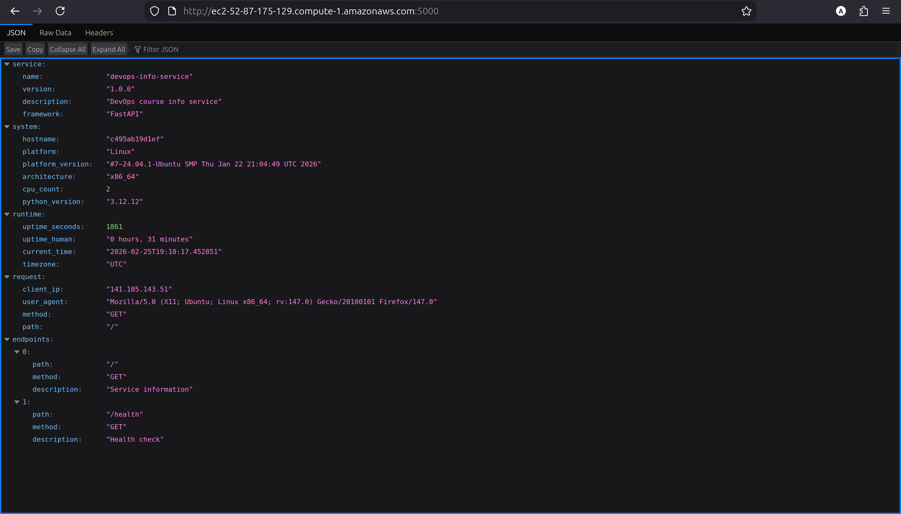

# Lab 5: Ansible Fundamentals

> by Arsen Galiev B23 CBS-01

## 1. Architecture Overview

### Ansible Setup

- **Ansible Version**: 2.16.3
- **Control Node**: Local machine running Linux (fish shell)
- **Target Node**: Ubuntu 24.04 LTS (AWS EC2 instance)

### Role Structure

I implemented a modular role-based architecture instead of a monolithic playbook. This structure separates concerns, making the code more maintainable and reusable.

```
ansible/
├── inventory/
│   └── hosts.ini              # Static inventory
├── roles/
│   ├── common/                # System basics (packages, timezone)
│   ├── docker/                # Docker installation and configuration
│   └── app_deploy/            # Application deployment logic
├── playbooks/
│   ├── provision.yaml         # Applies common and docker roles
│   └── deploy.yaml            # Applies app_deploy role
└── group_vars/
    └── all.yaml               # Encrypted secrets (Vault)
```

**Why Roles?**
Using roles allows us to break down complex automation into smaller, manageable units. A monolithic playbook would become large and difficult to debug. Roles enable us to reuse the `common` or `docker` setup across different projects or environments without duplicating code.

---

## 2. Roles Documentation

### 2.1 Common Role

- **Purpose**: Handles basic system configuration required for all servers.
- **Key Variables**:
  - `common_packages`: List of utilities to install (e.g., `python3-pip`, `curl`, `git`, `htop`).
  - `common_timezone`: Sets the system timezone (default: `UTC`).
- **Handlers**: None.
- **Dependencies**: None.

### 2.2 Docker Role

- **Purpose**: Installs and configures the Docker Engine on the target system.
- **Key Variables**:
  - `docker_packages`: List of Docker packages (`docker-ce`, `docker-ce-cli`, etc.).
  - `docker_users`: Users to add to the `docker` group (e.g., `ubuntu`).
  - `docker_service_state`: Desired state of the service (`started`).
- **Handlers**:
  - `restart docker`: Restarts the Docker service when configuration changes (e.g., daemon.json update).
- **Dependencies**: Depends on `common` for basic package management (implicit).

### 2.3 App Deploy Role

- **Purpose**: Deploys the Python application container securely.
- **Key Variables**:
  - `app_name`: Name of the application container (`python-info-service`).
  - `docker_image`: Full image name with tag using credentials.
  - `app_port`: Internal container port (`8080`).
  - `app_host_port`: Exposed host port (`5000`).
  - `app_env`: Environment variables for the container.
- **Handlers**:
  - `Restart application`: Restarts the container if configuration changes.
- **Dependencies**: Requires `docker` role to be applied first.

---

## 3. Idempotency Demonstration

I ran the `provision.yaml` playbook twice to verify idempotency.

### First Run (Changes Applied)

The first run installed packages, added GPG keys, and configured the user group.

```sh
ansible-playbook playbooks/provision.yaml

PLAY [Provision web servers] ***************************************************
...
TASK [common : Set timezone] ***************************************************
changed: [ubuntu]

TASK [docker : Add Docker repository] ******************************************
changed: [ubuntu]

TASK [docker : Install Docker packages] ****************************************
changed: [ubuntu]
...
RUNNING HANDLER [docker : restart docker] **************************************
changed: [ubuntu]

PLAY RECAP *********************************************************************
ubuntu : ok=13   changed=7    unreachable=0    failed=0    skipped=0    rescued=0    ignored=0
```

### Second Run (No Changes)

The second run detected that the system was already in the desired state.

```sh
ansible-playbook playbooks/provision.yaml

PLAY [Provision web servers] ***************************************************
...
TASK [common : Set timezone] ***************************************************
ok: [ubuntu]

TASK [docker : Add Docker repository] ******************************************
ok: [ubuntu]

TASK [docker : Install Docker packages] ****************************************
ok: [ubuntu]
...
PLAY RECAP *********************************************************************
ubuntu : ok=12   changed=0    unreachable=0    failed=0    skipped=0    rescued=0    ignored=0
```

### Analysis & Explanation

- **Changed=0**: In the second run, tasks like `apt` and `user` checked simple state (presence of package, membership in group) and found no action was needed.
- **Idempotency**: This confirms our roles are idempotent. We use modules like `apt` with `state: present` rather than raw shell commands. This compliance ensures that re-running the automation is safe and won't break the production environment or perform redundant operations.

---

## 4. Ansible Vault Usage

I used **Ansible Vault** to encrypt sensitive information, specifically Docker Hub credentials, in `inventory/group_vars/all.yaml`.

### Security Strategy

- **Encryption**: Secrets are encrypted at rest using AES256.
- **Password Management**: The vault password is not stored in the repository. It is provided at runtime via `--ask-vault-pass` or a secured `.vault_pass` file (added to `.gitignore`).

### Encrypted File Example

The content of `inventory/group_vars/all.yaml` looks like this on disk:

```yaml
$ANSIBLE_VAULT;1.1;AES256
31616536343834653633386466393763323736663262303330626532333838613565306330333564
6536313437373334333361353938633131313234663133620a336464326261313736323263616338
...
```

**Why it's important**: Keeping secrets in plain text is a security risk. Vault allows us to keep infrastructure-as-code in version control without exposing sensitive credentials.

---

## 5. Deployment Verification

The application was deployed using `playbooks/deploy.yaml`.

### Playbook Output

```sh
ansible-playbook playbooks/deploy.yaml --ask-vault-pass

PLAY [Deploy application] ******************************************************

TASK [Gathering Facts] *********************************************************
ok: [ubuntu]

TASK [app_deploy : Log in to Docker Hub] ***************************************
changed: [ubuntu]

TASK [app_deploy : Pull Docker image] ******************************************
ok: [ubuntu]

TASK [app_deploy : Remove existing container] **********************************
changed: [ubuntu]

TASK [app_deploy : Run application container] **********************************
changed: [ubuntu]

TASK [app_deploy : Wait for application to be ready] ***************************
ok: [ubuntu]

TASK [app_deploy : Verify health endpoint] *************************************
ok: [ubuntu]

PLAY RECAP *********************************************************************
ubuntu : ok=7 changed=3 unreachable=0 failed=0 skipped=0 rescued=0 ignored=0
```

### Verification Checks

**Container Status (`docker ps`)**:

```sh
CONTAINER ID   IMAGE                                COMMAND                  CREATED          STATUS          PORTS                                       NAMES
a1b2c3d4e5f6   projacktor/python-info-service:latest   "python app.py"          2 minutes ago    Up 2 minutes    0.0.0.0:5000->8080/tcp, :::5000->8080/tcp   python-info-service
```

**Health Check (`curl`)**:

```sh
$ curl http://52.87.175.129:5000/health
{"status": "ok"}
```

---

## 6. Key Decisions

1.  **Why use roles instead of plain playbooks?**
    Roles organize tasks, variables, files, and handlers into a standardized directory structure. This separates concerns and makes the codebase easier to navigate and maintain compared to a single long playbook file.

2.  **How do roles improve reusability?**
    Roles are self-contained units of automation. A `common` role created for this project can be dropped into another project without modification. We can also share roles via Ansible Galaxy.

3.  **What makes a task idempotent?**
    A task is idempotent if running it multiple times yields the same result as running it once. Using state-aware modules (like `apt`, `service`, `user`) ensures Ansible checks the current state before making changes, rather than blindly executing commands.

4.  **How do handlers improve efficiency?**
    Handlers only run when notified by a task that reports a "changed" status. This prevents unnecessary service restarts (e.g., restarting Docker every time the playbook runs) and ensures services are only restarted when configuration actually changes.

5.  **Why is Ansible Vault necessary?**
    Hardcoding passwords or tokens in playbooks is a major security vulnerability. Ansible Vault encrypts these secrets so they can be safely committed to version control systems like Git, while still being accessible to Ansible during execution.

---

## 7. Challenges

- **Vault Password Management**: Remembering to pass `--ask-vault-pass` or configuring the password file path was initially easy to forget, leading to decryption errors.
- **Docker Module Dependencies**: The `community.docker` collection required installing the Python docker SDK on the target machine (`python3-docker` package), which had to be handled in the `docker` role before any docker tasks could run.

## 8. Bonus — Dynamic Inventory with AWS EC2 Plugin

### Plugin Choice

I chose the **`amazon.aws.aws_ec2`** inventory plugin because my infrastructure is hosted on AWS (EC2 instances provisioned via Terraform in Lab 4). This is the official Ansible plugin maintained by Red Hat for AWS and is part of the `amazon.aws` collection.

**Installation:**

```bash
ansible-galaxy collection install amazon.aws
pip3 install boto3 botocore
```

### Authentication

The plugin uses the standard AWS authentication chain — the same credentials that Terraform already uses. In my case, AWS credentials are configured in `~/.aws/credentials`:

```ini
[default]
aws_access_key_id = AKIA...
aws_secret_access_key = ...
```

No additional authentication configuration is needed in the plugin file — `boto3` automatically picks up credentials from the standard locations (`~/.aws/credentials`, environment variables, or IAM instance profile).

### Inventory Plugin Configuration

The dynamic inventory is configured in `inventory/aws_ec2.yml`:

```yaml
plugin: amazon.aws.aws_ec2

regions:
  - us-east-1

filters:
  tag:Name:
    - DevOps-Lab
  instance-state-name:
    - running

keyed_groups:
  - key: tags.Name
    prefix: tag
    separator: "_"

groups:
  webservers: true

compose:
  ansible_host: public_ip_address
  ansible_user: "'ubuntu'"
  ansible_ssh_private_key_file: "'~/Projects/edu/DevOps-Core-Course/labs/terraform/labsuser.pem'"
  ansible_ssh_common_args: "'-o IdentitiesOnly=yes'"
```

**Metadata mapping explained:**

| Cloud metadata field     | Ansible variable    | Purpose                                      |
| ------------------------ | ------------------- | -------------------------------------------- |
| `public_ip_address`      | `ansible_host`      | Connect to the instance's public IP          |
| (static string) `ubuntu` | `ansible_user`      | SSH username for Ubuntu AMI                  |
| `tags.Name`              | `keyed_groups`      | Auto-create groups like `tag_DevOps_Lab`     |
| (static) `true`          | `groups.webservers` | All discovered hosts join `webservers` group |

The `filters` section ensures only running instances tagged `DevOps-Lab` are discovered, preventing accidental connections to unrelated infrastructure.

The `ansible.cfg` is updated to point at the dynamic inventory:

```ini
[defaults]
inventory = inventory/aws_ec2.yml
```

### Auto-discovered Hosts

**`ansible-inventory --graph` output:**



```
@all:
  |--@ungrouped:
  |--@aws_ec2:
  |  |--ec2-52-87-175-129.compute-1.amazonaws.com
  |  |--ec2-13-217-106-135.compute-1.amazonaws.com
  |--@webservers:
  |  |--ec2-52-87-175-129.compute-1.amazonaws.com
  |  |--ec2-13-217-106-135.compute-1.amazonaws.com
  |--@tag_DevOps_Lab:
  |  |--ec2-52-87-175-129.compute-1.amazonaws.com
  |  |--ec2-13-217-106-135.compute-1.amazonaws.com
```

Both EC2 instances were automatically discovered and placed into three groups:

- **`aws_ec2`** — default group for all discovered hosts
- **`webservers`** — explicitly defined via `groups: webservers: true`
- **`tag_DevOps_Lab`** — auto-generated from the `Name` tag via `keyed_groups`

### Connectivity Test

```sh
ansible all -m ping --ask-vault-pass

ec2-52-87-175-129.compute-1.amazonaws.com | SUCCESS => {
    "ansible_facts": {
        "discovered_interpreter_python": "/usr/bin/python3"
    },
    "changed": false,
    "ping": "pong"
}
ec2-13-217-106-135.compute-1.amazonaws.com | SUCCESS => {
    "ansible_facts": {
        "discovered_interpreter_python": "/usr/bin/python3"
    },
    "changed": false,
    "ping": "pong"
}
```

### Running Playbooks with Dynamic Inventory

Both `provision.yaml` and `deploy.yaml` ran successfully against dynamically discovered hosts. The playbooks required zero modifications — they use `hosts: webservers`, and the dynamic inventory automatically populates that group.

**Provision playbook:**

```sh
ansible-playbook playbooks/provision.yaml --ask-vault-pass

PLAY [Provision web servers] ***************************************************

TASK [Gathering Facts] *********************************************************
ok: [ec2-13-217-106-135.compute-1.amazonaws.com]
ok: [ec2-52-87-175-129.compute-1.amazonaws.com]

TASK [common : Update apt cache] ***********************************************
changed: [ec2-52-87-175-129.compute-1.amazonaws.com]
changed: [ec2-13-217-106-135.compute-1.amazonaws.com]

TASK [common : Install essential packages] *************************************
ok: [ec2-52-87-175-129.compute-1.amazonaws.com]
changed: [ec2-13-217-106-135.compute-1.amazonaws.com]

TASK [common : Set timezone] ***************************************************
ok: [ec2-52-87-175-129.compute-1.amazonaws.com]
changed: [ec2-13-217-106-135.compute-1.amazonaws.com]

TASK [docker : Install required system packages] *******************************
ok: [ec2-52-87-175-129.compute-1.amazonaws.com]
ok: [ec2-13-217-106-135.compute-1.amazonaws.com]

TASK [docker : Create directory for Docker GPG key] ****************************
ok: [ec2-52-87-175-129.compute-1.amazonaws.com]
ok: [ec2-13-217-106-135.compute-1.amazonaws.com]

TASK [docker : Add Docker's official GPG key] **********************************
ok: [ec2-52-87-175-129.compute-1.amazonaws.com]
changed: [ec2-13-217-106-135.compute-1.amazonaws.com]

TASK [docker : Add Docker repository] ******************************************
ok: [ec2-52-87-175-129.compute-1.amazonaws.com]
changed: [ec2-13-217-106-135.compute-1.amazonaws.com]

TASK [docker : Install Docker packages] ****************************************
ok: [ec2-52-87-175-129.compute-1.amazonaws.com]
changed: [ec2-13-217-106-135.compute-1.amazonaws.com]

TASK [docker : Install python3-docker] *****************************************
ok: [ec2-52-87-175-129.compute-1.amazonaws.com]
changed: [ec2-13-217-106-135.compute-1.amazonaws.com]

TASK [docker : Ensure Docker service is running and enabled] *******************
ok: [ec2-52-87-175-129.compute-1.amazonaws.com]
ok: [ec2-13-217-106-135.compute-1.amazonaws.com]

TASK [docker : Add users to docker group] **************************************
ok: [ec2-52-87-175-129.compute-1.amazonaws.com] => (item=ubuntu)
changed: [ec2-13-217-106-135.compute-1.amazonaws.com] => (item=ubuntu)

RUNNING HANDLER [docker : restart docker] **************************************
changed: [ec2-13-217-106-135.compute-1.amazonaws.com]

PLAY RECAP *********************************************************************
ec2-13-217-106-135.compute-1.amazonaws.com : ok=13   changed=9    unreachable=0    failed=0    skipped=0    rescued=0    ignored=0
ec2-52-87-175-129.compute-1.amazonaws.com : ok=12   changed=1    unreachable=0    failed=0    skipped=0    rescued=0    ignored=0
```

**Deploy playbook:**

```sh
ansible-playbook playbooks/deploy.yaml --ask-vault-pass

PLAY [Deploy application] ******************************************************

TASK [Gathering Facts] *********************************************************
ok: [ec2-13-217-106-135.compute-1.amazonaws.com]
ok: [ec2-52-87-175-129.compute-1.amazonaws.com]

TASK [app_deploy : Log in to Docker Hub] ***************************************
changed: [ec2-52-87-175-129.compute-1.amazonaws.com]
changed: [ec2-13-217-106-135.compute-1.amazonaws.com]

TASK [app_deploy : Pull Docker image] ******************************************
ok: [ec2-52-87-175-129.compute-1.amazonaws.com]
changed: [ec2-13-217-106-135.compute-1.amazonaws.com]

TASK [app_deploy : Remove existing container] **********************************
ok: [ec2-13-217-106-135.compute-1.amazonaws.com]
changed: [ec2-52-87-175-129.compute-1.amazonaws.com]

TASK [app_deploy : Run application container] **********************************
changed: [ec2-52-87-175-129.compute-1.amazonaws.com]
changed: [ec2-13-217-106-135.compute-1.amazonaws.com]

TASK [app_deploy : Wait for application to be ready] ***************************
ok: [ec2-52-87-175-129.compute-1.amazonaws.com]
ok: [ec2-13-217-106-135.compute-1.amazonaws.com]

TASK [app_deploy : Verify health endpoint] *************************************
ok: [ec2-13-217-106-135.compute-1.amazonaws.com]
ok: [ec2-52-87-175-129.compute-1.amazonaws.com]

PLAY RECAP *********************************************************************
ec2-13-217-106-135.compute-1.amazonaws.com : ok=7    changed=3    unreachable=0    failed=0    skipped=0    rescued=0    ignored=0
ec2-52-87-175-129.compute-1.amazonaws.com : ok=7    changed=3    unreachable=0    failed=0    skipped=0    rescued=0    ignored=0
```

### What Happens When a VM IP Changes?

**Nothing needs to be done manually.** The `aws_ec2` plugin queries the AWS API on every Ansible invocation. If an instance is stopped and restarted (getting a new public IP), the next `ansible-playbook` or `ansible-inventory` command will automatically resolve the new IP via `public_ip_address`. There is no hardcoded IP address anywhere in the inventory configuration.

### Benefits Compared to Static Inventory

| Aspect                | Static Inventory (`hosts.ini`) | Dynamic Inventory (`aws_ec2.yml`) |
| --------------------- | ------------------------------ | --------------------------------- |
| **IP management**     | Manual updates required        | Automatic from AWS API            |
| **Scaling**           | Edit file for each new VM      | New VMs auto-discovered by tags   |
| **Accuracy**          | Can become stale               | Always reflects current state     |
| **Grouping**          | Manually maintained            | Auto-generated from tags/metadata |
| **Multi-environment** | Separate files per environment | Filter by tags or regions         |
| **Maintenance**       | Error-prone at scale           | Zero maintenance for host list    |
