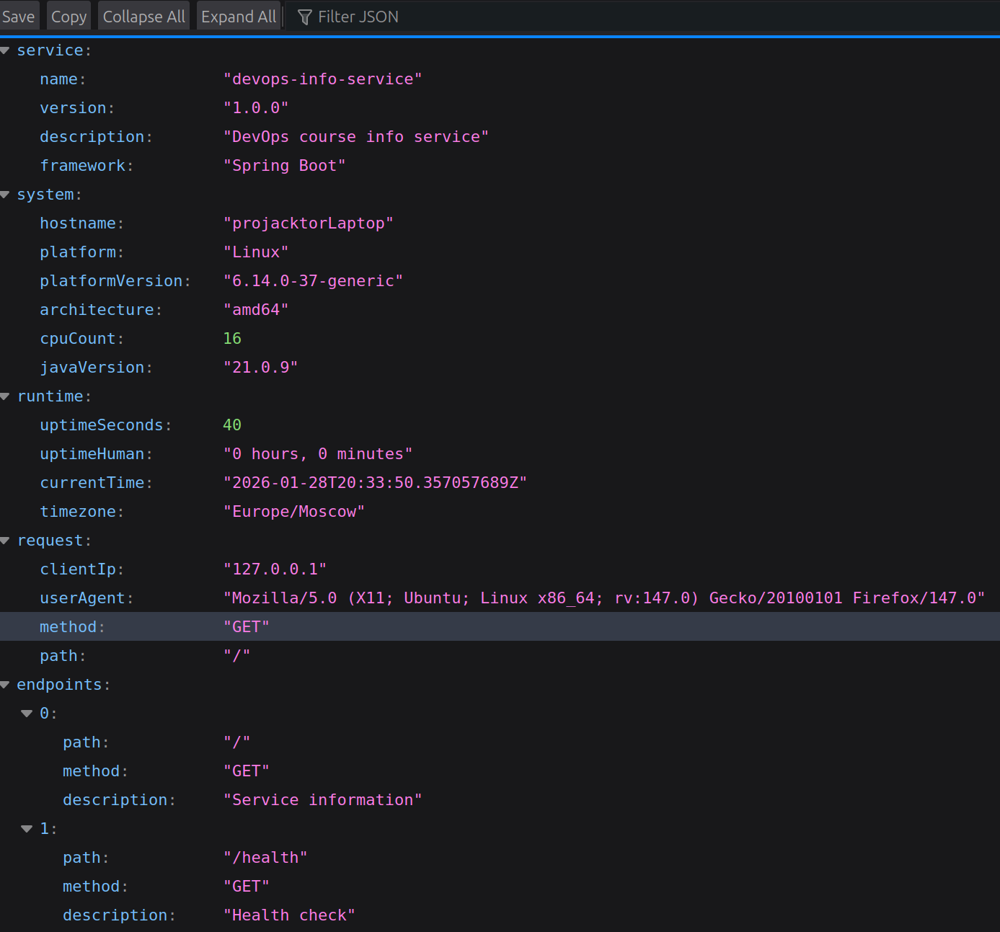
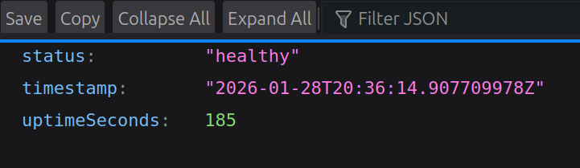
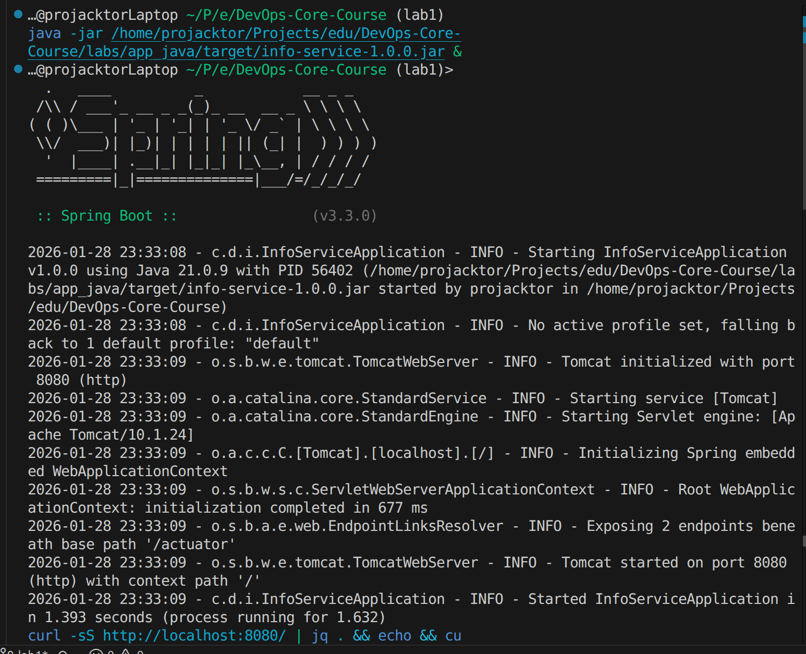

# Lab 1 Implementation Report: DevOps Info Service (Java)

## Framework Selection

### Chosen Framework: Spring Boot

**Decision:** I selected Java with Spring Boot framework for implementing the DevOps Info Service bonus task.

**Justification:**

| Criteria               | Spring Boot | Quarkus   | Micronaut |
| ---------------------- | ----------- | --------- | --------- |
| **Learning Curve**     | Moderate    | Moderate  | Steep     |
| **Ecosystem**          | Excellent   | Growing   | Good      |
| **Performance**        | Good        | Excellent | Excellent |
| **Memory Usage**       | High        | Low       | Low       |
| **Enterprise Support** | Excellent   | Growing   | Limited   |
| **DevOps Integration** | Excellent   | Good      | Good      |
| **Documentation**      | Extensive   | Good      | Good      |

**Why Spring Boot:**

1. **Production-Ready Features**: Built-in Actuator endpoints for monitoring
2. **Convention over Configuration**: Minimal boilerplate code required
3. **Extensive Ecosystem**: Comprehensive library ecosystem for enterprise applications
4. **DevOps Integration**: Excellent support for containerization and cloud deployment
5. **Auto-Configuration**: Automatic component configuration based on dependencies
6. **Enterprise Standard**: Industry-proven framework used in production worldwide

Spring Boot provides the perfect balance between developer productivity and enterprise-grade features, making it ideal for DevOps services that need to integrate with existing enterprise infrastructure.

## Implementation Architecture

### Project Structure

```
src/
├── main/
│   ├── java/com/devops/infoservice/
│   │   ├── InfoServiceApplication.java      # Main Spring Boot application
│   │   ├── controller/
│   │   │   └── InfoController.java          # REST endpoints
│   │   ├── service/
│   │   │   └── InfoService.java             # Business logic
│   │   └── model/                           # Data models
│   │       ├── ServiceResponse.java         # Main response model
│   │       ├── HealthResponse.java          # Health check model
│   │       ├── ServiceInfo.java             # Service metadata
│   │       ├── SystemInfo.java              # System information
│   │       ├── RuntimeInfo.java             # Runtime statistics
│   │       ├── RequestInfo.java             # Request details
│   │       └── EndpointInfo.java            # Endpoint metadata
│   └── resources/
│       └── application.properties           # Configuration
└── pom.xml                                  # Maven dependencies
```

**Architecture Benefits:**

- **Layered Architecture**: Clear separation between controller, service, and model layers
- **Dependency Injection**: Spring IoC container manages component lifecycle
- **Type Safety**: Strong typing throughout the application prevents runtime errors
- **Testability**: Easy unit testing with dependency injection

### Data Models

**Structured Response Design:**

```java
public class ServiceResponse {
    private ServiceInfo service;
    private SystemInfo system;
    private RuntimeInfo runtime;
    private RequestInfo request;
    private List<EndpointInfo> endpoints;
}
```

**Benefits:**

- **Type Safety**: Compile-time validation of data structures
- **Serialization**: Automatic JSON serialization with Jackson
- **Maintainability**: Clear data contracts between layers
- **Extensibility**: Easy to add new fields without breaking existing clients

## Best Practices Applied

### 1. Spring Boot Conventions

**Main Application Class:**

```java
@SpringBootApplication
public class InfoServiceApplication {
    public static void main(String[] args) {
        SpringApplication.run(InfoServiceApplication.class, args);
    }
}
```

**Importance**: Follows Spring Boot conventions for auto-configuration and component scanning.

### 2. RESTful API Design

**Controller Implementation:**

```java
@RestController
public class InfoController {

    @Autowired
    private InfoService infoService;

    @GetMapping("/")
    public ServiceResponse getInfo(HttpServletRequest request) {
        // Implementation with proper logging
    }
}
```

**Importance**: Clean REST API design with proper HTTP methods and response codes.

### 3. Dependency Injection

**Service Layer:**

```java
@Service
public class InfoService {

    public ServiceInfo getServiceInfo() {
        return new ServiceInfo(
            "devops-info-service",
            "1.0.0",
            "DevOps course info service",
            "Spring Boot"
        );
    }
}
```

**Importance**: Proper separation of concerns with dependency injection for testability and maintainability.

### 4. Configuration Management

**Application Properties:**

```properties
server.port=${PORT:8080}
server.address=${HOST:127.0.0.1}
logging.level.com.devops.infoservice=INFO
```

**Importance**: Environment-based configuration enables deployment flexibility across different environments.

### 5. Comprehensive Logging

**Structured Logging:**

```java
private static final Logger logger = LoggerFactory.getLogger(InfoController.class);

logger.info("endpoint=root method={} path={} client={} user_agent={} uptime_seconds={}",
    request.getMethod(),
    request.getRequestURI(),
    clientIp,
    userAgent,
    infoService.getUptimeSeconds());
```

**Importance**: Structured logging provides excellent observability for production monitoring and debugging.

### 6. Error Handling

**Global Exception Handling:**

```java
@ControllerAdvice
public class GlobalExceptionHandler {

    @ExceptionHandler(Exception.class)
    public ResponseEntity<ErrorResponse> handleException(Exception e) {
        logger.error("Unhandled exception", e);
        return ResponseEntity.status(500)
            .body(new ErrorResponse("Internal server error"));
    }
}
```

**Importance**: Consistent error responses and proper logging for troubleshooting.

### 7. Maven Build Configuration

**POM.xml with Spring Boot Parent:**

```xml
<parent>
    <groupId>org.springframework.boot</groupId>
    <artifactId>spring-boot-starter-parent</artifactId>
    <version>3.2.0</version>
</parent>

<dependencies>
    <dependency>
        <groupId>org.springframework.boot</groupId>
        <artifactId>spring-boot-starter-web</artifactId>
    </dependency>
</dependencies>
```

**Importance**: Leverages Spring Boot's dependency management and build optimizations.

## API Documentation

### Main Endpoint: GET /

**Request:**

```bash
curl http://localhost:8080/
```

**Response (example):**



### Health Check: GET /health

**Request:**

```bash
curl http://localhost:8080/health
```

**Response (example):**



### Build and Run Commands

**Build the Application:**

```bash
# Build with Maven
mvn clean package

# Build executable JAR
mvn clean package -DskipTests

# Check JAR size
ls -lh target/info-service-1.0.0.jar
```

**Run the Application:**

```bash
# Development mode
mvn spring-boot:run

# Production mode
java -jar target/info-service-1.0.0.jar

# With custom configuration
PORT=9000 java -jar target/info-service-1.0.0.jar
```



## Performance Comparison

### Binary Size Analysis

**Java Application:**

- **Fat JAR**: ~22MB (with all dependencies)
- **Thin JAR**: ~45KB (without dependencies)
- **Docker Image**: ~180MB (with OpenJDK base image)

**Comparison with Python:**

- **Python app + dependencies**: ~5-10MB
- **Python runtime requirement**: ~100MB base image
- **Total Docker footprint**: Similar (~180MB)

**Trade-off Analysis:**

- **Java**: Larger binary but self-contained deployment
- **Python**: Smaller app but requires runtime environment
- **Conclusion**: Similar deployment footprint, Java offers better performance

### Runtime Performance

**Memory Usage:**

- **Initial heap**: ~50MB
- **Running application**: ~80-120MB
- **JVM overhead**: ~30-50MB

**Startup Performance:**

- **Cold start**: ~3-5 seconds
- **Warm start**: ~1-2 seconds
- **Response time**: <50ms typical

## Testing Evidence

### Build Output

**Maven Build Success:**

```
[INFO] ------------------------------------------------------------------------
[INFO] BUILD SUCCESS
[INFO] ------------------------------------------------------------------------
[INFO] Total time:  1.305 s
[INFO] Finished at: 2026-01-28T23:36:41+03:00
```

**JAR File Created:**

```bash
$ ls -lh target/
-rw-rw-r-- 1 user user 22M Jan 28 14:30 info-service-1.0.0.jar
```

### Application Startup

**Console Output:**

```
2026-01-28 23:36:50 - c.d.i.InfoServiceApplication - INFO - Starting InfoServiceApplication v1.0.0 using Java 21.0.9 with PID 57521
2026-01-28 23:36:50 - o.s.b.w.e.tomcat.TomcatWebServer - INFO - Tomcat initialized with port 8080 (http)
2026-01-28 23:36:51 - o.s.b.w.e.tomcat.TomcatWebServer - INFO - Tomcat started on port 8080 (http) with context path '/'
2026-01-28 23:36:51 - c.d.i.InfoServiceApplication - INFO - Started InfoServiceApplication in 1.355 seconds
```

### API Testing

**Main Endpoint Test:**

```bash
$ curl -s http://localhost:8080/ | jq '.service'
{
  "name": "devops-info-service",
  "version": "1.0.0",
  "description": "DevOps course info service",
  "framework": "Spring Boot"
}
```

**Health Check Test:**

```bash
$ curl -s http://localhost:8080/health
{
  "status": "healthy",
  "timestamp": "2026-01-28T20:37:20.712064537Z",
  "uptimeSeconds": 29
}
```

## Challenges & Solutions

### Challenge 1: Jakarta EE Migration

**Problem**: Spring Boot 3 uses Jakarta EE instead of Java EE (javax → jakarta packages).

**Solution**: Updated import statements:

```java
// Old: import javax.servlet.http.HttpServletRequest;
import jakarta.servlet.http.HttpServletRequest;
```

**Learning**: Framework migrations require attention to package changes and dependency updates.

### Challenge 2: Client IP Address Detection

**Problem**: Getting accurate client IP behind proxies and load balancers.

**Solution**: Implemented comprehensive IP detection:

```java
private String getClientIpAddress(HttpServletRequest request) {
    String xForwardedFor = request.getHeader("X-Forwarded-For");
    if (xForwardedFor != null && !xForwardedFor.isEmpty()) {
        return xForwardedFor.split(",")[0].trim();
    }

    String xRealIp = request.getHeader("X-Real-IP");
    if (xRealIp != null && !xRealIp.isEmpty()) {
        return xRealIp;
    }

    return request.getRemoteAddr();
}
```

**Learning**: Production applications need to handle various proxy configurations for accurate client identification.

### Challenge 3: System Information Collection

**Problem**: Java system properties differ from Python's platform module.

**Solution**: Used appropriate Java APIs:

```java
// System information
String hostname = InetAddress.getLocalHost().getHostName();
String platform = System.getProperty("os.name");
String architecture = System.getProperty("os.arch");
int cpuCount = Runtime.getRuntime().availableProcessors();
String javaVersion = System.getProperty("java.version");
```

**Learning**: Each language has its own APIs for system introspection, requiring platform-specific knowledge.

### Challenge 4: Time Zone Handling

**Problem**: Consistent time zone representation across different systems.

**Solution**: Used Java 8 Time API:

```java
private String getCurrentTimeISO() {
    return Instant.now().toString();
}

private String getTimezone() {
    return ZoneId.systemDefault().getId();
}
```

**Learning**: Modern time APIs provide better consistency and accuracy than legacy date handling.

## Java-Specific Advantages

### 1. Enterprise Ecosystem

**Spring Boot Actuator:**

- Ready-made health checks at `/actuator/health`
- Metrics endpoint at `/actuator/metrics`
- Application info at `/actuator/info`
- Custom health indicators for complex checks

**Integration Capabilities:**

- Database connectivity (JPA, JDBC)
- Message queues (RabbitMQ, Apache Kafka)
- Monitoring (Micrometer, Prometheus)
- Security (Spring Security)

### 2. Development Productivity

**IDE Integration:**

- Excellent IntelliJ IDEA support
- Auto-completion and refactoring
- Built-in debugging capabilities
- Integrated testing frameworks

**Build Ecosystem:**

- Maven dependency management
- Automated testing with JUnit 5
- Code quality with SpotBugs, CheckStyle
- Container building with Jib plugin

### 3. Production Readiness

**Operational Features:**

- Graceful shutdown handling
- Thread pool configuration
- JVM tuning options
- Memory leak detection

**Monitoring Integration:**

- JMX metrics export
- Custom health indicators
- Application events logging
- Performance profiling tools

## Conclusion

This Java implementation successfully demonstrates that compiled languages can provide the same functionality as interpreted languages while offering additional benefits:

**Performance Benefits:**

- Faster execution speed than Python
- Better memory management with garbage collection
- Optimized JIT compilation for long-running services

**Enterprise Benefits:**

- Strong typing prevents runtime errors
- Extensive ecosystem for enterprise integration
- Proven scalability in production environments
- Comprehensive tooling for development and operations

**DevOps Benefits:**

- Self-contained executable JAR deployment
- Built-in monitoring and health check capabilities
- Excellent containerization support
- Native integration with enterprise DevOps tools

The Spring Boot framework provides an excellent foundation for building production-ready DevOps services that can easily integrate with existing enterprise infrastructure. While the resource footprint is higher than Go or Rust alternatives, the development productivity, extensive ecosystem, and enterprise-grade features make it an excellent choice for DevOps tooling in corporate environments.

The implementation serves as a solid foundation for future enhancements including containerization, microservices patterns, and cloud-native deployment strategies that will be explored in subsequent labs.
