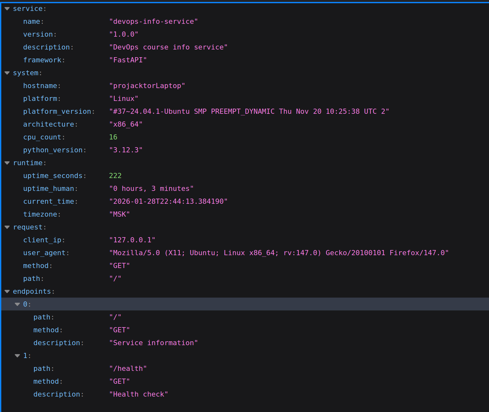
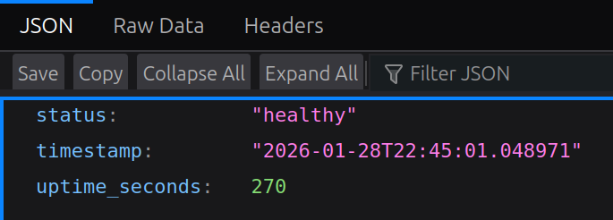

# Lab 1 Implementation Report: DevOps Info Service

## Framework Selection

### Chosen Framework: FastAPI

**Decision:** I selected FastAPI for implementing the DevOps Info Service.

**Justification:**

| Criteria               | Flask        | FastAPI   | Django            |
| ---------------------- | ------------ | --------- | ----------------- |
| **Learning Curve**     | Easy         | Moderate  | Steep             |
| **Performance**        | Good         | Excellent | Good              |
| **Async Support**      | Limited      | Native    | Limited           |
| **Auto Documentation** | Manual       | Automatic | Manual            |
| **Type Safety**        | Optional     | Built-in  | Optional          |
| **API Development**    | Manual setup | Optimized | Overkill for APIs |
| **Modern Features**    | Basic        | Advanced  | Full-stack        |

**Why FastAPI:**

1. **Automatic API Documentation**: Built-in Swagger/OpenAPI documentation at `/docs`
2. **Type Safety**: Native support for Python type hints with validation
3. **Async Support**: Native async/await support for better performance
4. **Modern Python**: Leverages Python 3.6+ features like type hints
5. **JSON Handling**: Excellent built-in JSON serialization and validation
6. **Future-Ready**: Ideal foundation for microservices and cloud-native applications

FastAPI strikes the perfect balance between simplicity and advanced features, making it ideal for DevOps tooling that may need to scale or integrate with other services.

## Best Practices Applied

### 1. Code Organization and Structure

```python
# Clear module docstring
"""
DevOps Info Service
Main application module
"""

# Organized imports
from fastapi import FastAPI, Request, Response
import logging
import platform
import socket
from datetime import datetime
import os
```

**Importance**: Clean organization improves readability and maintainability, crucial for DevOps tools that evolve over time.

### 2. Configuration Management

```python
# Environment-based configuration
HOST = os.getenv("HOST", "127.0.0.1")
PORT = int(os.getenv("PORT", 8080))
DEBUG = os.getenv("DEBUG", "false").lower() == "true"
```

**Importance**: Environment variables enable deployment flexibility across different environments (dev, staging, production) without code changes.

### 3. Comprehensive Logging

```python
logging.basicConfig(
    level=logging.INFO,
    format='%(asctime)s - %(name)s - %(levelname)s - %(message)s'
)
logger = logging.getLogger(__name__)

# Structured logging with context
logger.info(
    "endpoint=root method=%s path=%s client=%s user_agent=%s uptime_seconds=%d",
    request.method,
    request.url.path,
    request.client.host if request.client else "unknown",
    request.headers.get("user-agent"),
    get_uptime()["seconds"]
)
```

**Importance**: Structured logging is essential for DevOps observability, debugging, and monitoring in production environments.

### 4. Error Handling

```python
@app.exception_handler(StarletteHTTPException)
async def http_exception_handler(request: Request, exc: StarletteHTTPException):
    if exc.status_code == 404:
        logger.warning("HTTP 404 on path=%s client=%s", request.url.path, request.client.host if request.client else "unknown")
        return JSONResponse(status_code=404, content={
            "error": "not_found",
            "message": "Endpoint does not exist",
        })
```

**Importance**: Proper error handling provides consistent API responses and helps with debugging and monitoring.

### 5. Function Documentation

```python
def get_system_info():
    """Collect system information."""
    return {
        "hostname": socket.gethostname(),
        "platform_name": platform.system(),
        # ...
    }
```

**Importance**: Clear documentation helps team collaboration and future maintenance.

### 6. Dependency Management

```python
# requirements.txt with pinned versions
fastapi==0.115.0
uvicorn[standard]==0.32.0
```

**Importance**: Pinned versions ensure reproducible builds across different environments.

## API Documentation

### Main Endpoint: GET /

**Request:**

```bash
curl http://localhost:8080/
```

**Response (browser version):**



### Health Check: GET /health

**Request:**

```bash
curl http://localhost:8080/health
```

**Response (browser version):**



### Testing Commands

**Basic Testing:**

```bash
# Start the service
python app.py

# Test main endpoint
curl http://localhost:8080/

# Test health endpoint
curl http://localhost:8080/health
```

**Configuration Testing:**

```bash
# Test custom port
PORT=9000 python app.py

# Test custom host
HOST=0.0.0.0 python app.py

# Test debug mode
DEBUG=true python app.py
```

## Testing Evidence

### Screenshots Captured:

1. **root-endpoint.png**: Shows the complete JSON response from GET /
2. **health-endpoint.png**: Shows the health check endpoint response
3. **Output.png**: Shows pretty-printed JSON output

### Terminal Output Examples:

**Service Startup:**

```
2026-01-28 21:15:32,456 - __main__ - INFO - Application starting...
INFO:     Started server process [12345]
INFO:     Waiting for application startup.
INFO:     Application startup complete.
INFO:     Uvicorn running on http://127.0.0.1:8080 (Press CTRL+C to quit)
```

**Request Logging:**

```
2026-01-28 21:16:15,789 - __main__ - INFO - endpoint=root method=GET path=/ client=127.0.0.1 user_agent=curl/8.5.0 uptime_seconds=43
2026-01-28 21:16:22,123 - __main__ - INFO - endpoint=health status=healthy uptime_seconds=50 timestamp=2026-01-28T21:16:22.123456
```

## Challenges & Solutions

### Challenge 1: Timezone Handling

**Problem**: Initial implementation didn't properly handle timezone information.

**Solution**: Used proper datetime timezone methods:

```python
"timezone": datetime.now().astimezone().tzname()
```

**Learning**: Timezone handling is important for global applications and proper time tracking.

### Challenge 3: Request Client Information

**Problem**: FastAPI's request.client can be None in some environments.

**Solution**: Added proper null checking:

```python
request.client.host if request.client else "unknown"
```

**Learning**: Defensive programming prevents runtime errors in different deployment scenarios.

### Challenge 4: Logging Format Consistency

**Problem**: Needed structured logging for better observability.

**Solution**: Implemented consistent logging format with key-value pairs:

```python
logger.info(
    "endpoint=health status=healthy uptime_seconds=%d timestamp=%s",
    get_uptime()["seconds"],
    datetime.now().isoformat()
)
```

**Learning**: Structured logging is essential for DevOps monitoring and debugging.

## Conclusion

This lab successfully implemented a comprehensive DevOps info service using FastAPI. The service provides detailed system introspection, proper error handling, structured logging, and serves as a solid foundation for future DevOps tooling. The choice of FastAPI proved excellent for this use case, offering modern Python features, automatic documentation, and excellent performance characteristics that will benefit subsequent labs in the course.

The implementation demonstrates key DevOps principles including configuration management, observability through logging, proper error handling, and API design best practices. These foundations will be essential as we progress through containerization, CI/CD, and deployment automation in future labs.
