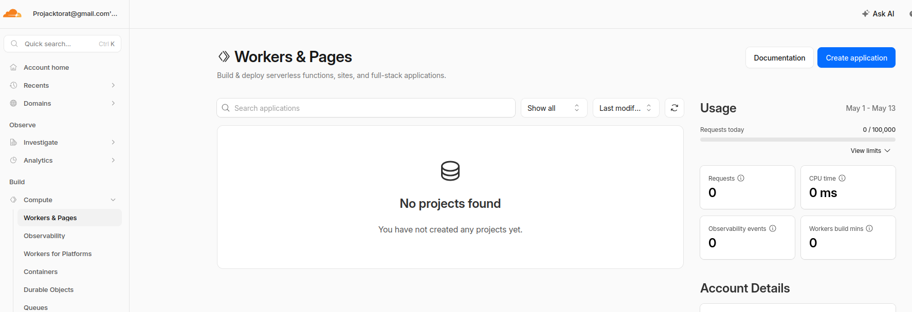
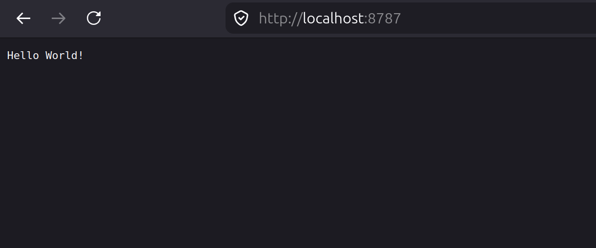
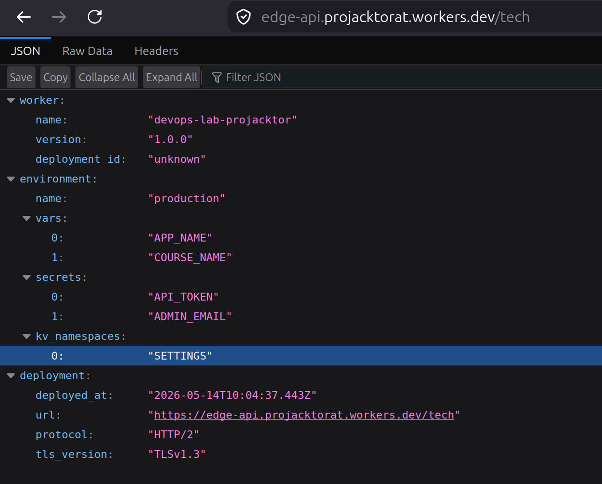
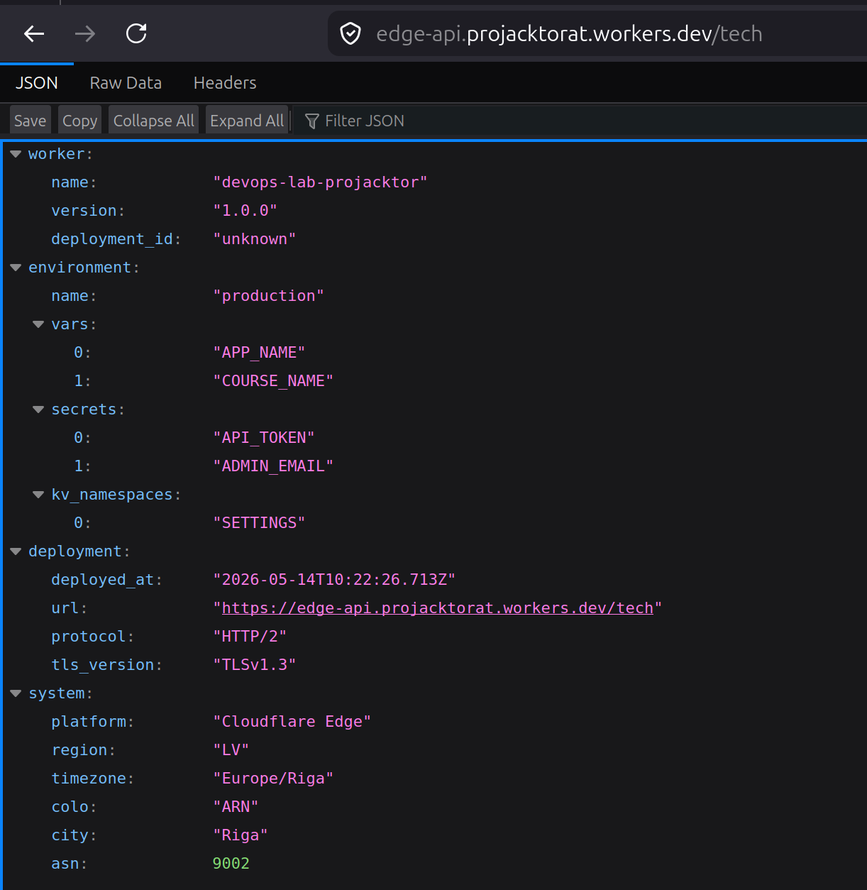
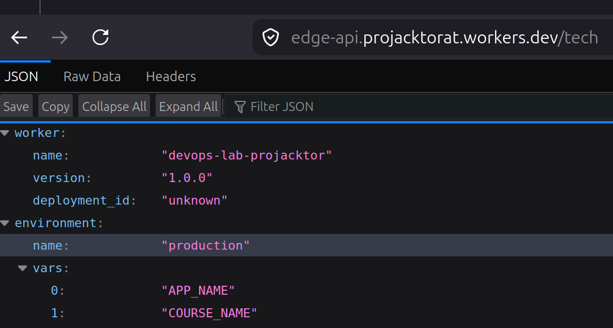
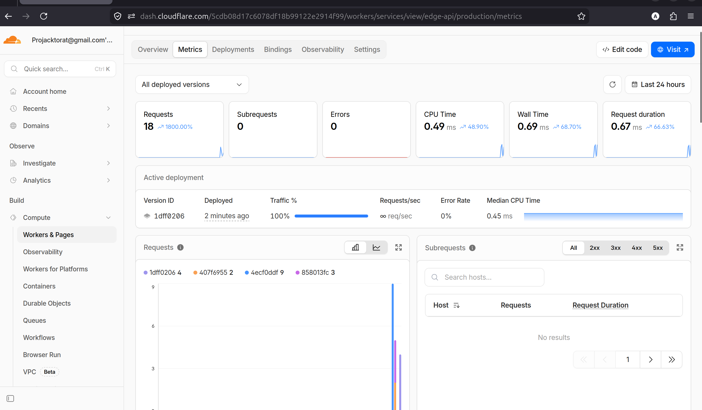

# Lab 17 Cloudflare workers

## Task 1

1) Account created



2) Application created

```sh
pnpm create cloudflare@latest -- edge-api

──────────────────────────────────────────────────────────────────────────────────────────────────────────
👋 Welcome to create-cloudflare v2.68.2!
🧡 Let's get started.
📊 Cloudflare collects telemetry about your usage of Create-Cloudflare.

Learn more at: https://github.com/cloudflare/workers-sdk/blob/main/packages/create-cloudflare/telemetry.md
──────────────────────────────────────────────────────────────────────────────────────────────────────────

╭ Create an application with Cloudflare Step 1 of 3
│
├ In which directory do you want to create your application?

# etc
```

3) Wrangler login

```sh
pnpx wrangler login
```

Identification:

```sh
pnpx wrangler whoami

 ⛅️ wrangler 4.90.1
───────────────────
Getting User settings...
👋 You are logged in with an OAuth Token, associated with the email projacktorat@gmail.com.
┌──────────────────────────────────┬──────────────────────────────────┐
│ Account Name                     │ Account ID                       │
├──────────────────────────────────┼──────────────────────────────────┤
│ Projacktorat@gmail.com's Account │ <my-account-id> │
└──────────────────────────────────┴──────────────────────────────────┘
🔓 Token Permissions:
Scope (Access)
<permission scopes>
```

[wrangler.jsonc](./edge-api/wrangler.jsonc) needed for CLI and worker configuring as in https://developers.cloudflare.com/workers/wrangler/configuration/ described.

## Task 2

```sh
pnpm run dev
```

It gives a single endpoint output:



Add more endpoints. I made `/` introductory, `/tech` with deployment info and `/healt` for healthcheck:

```sh
curl loca
lhost:8787/ | jq
  % Total    % Received % Xferd  Average Speed   Time    Time     Time  Current
                                 Dload  Upload   Total   Spent    Left  Speed
  0     0    0     0    0     0      0      0 --:--:-- --:--:-- --:--:-100   413  100   413    0     0   158k      0 --:--:-- --:--:-- --:--:--  201k
{
  "service": {
    "name": "cloudflare-edge-api",
    "version": "1.0.0",
    "description": "Cloudflare Worker Edge API",
    "framework": "Cloudflare Workers"
  },
  "runtime": {
    "platform": "Cloudflare Workers",
    "environment": "edge"
  },
  "endpoints": [
    {
      "path": "/",
      "method": "GET",
      "description": "Service information"
    },
    {
      "path": "/health",
      "method": "GET",
      "description": "Health check"
    },
    {
      "path": "/tech",
      "method": "GET",
      "description": "Deployment information"
    }
  ]
}

curl loca
lhost:8787/health | jq
  % Total    % Received % Xferd  Average Speed   Time    Time     Time  Current
                                 Dload  Upload   Total   Spent    Left  Speed
  0     0    0     0    0     0      0      0 --:--:-- --:--:-- --:--:-100    59  100    59    0     0  12129      0 --:--:-- --:--:-- --:--:-- 14750
{
  "status": "healthy",
  "timestamp": "2026-05-14T10:01:25.467Z"
}

curl loca
lhost:8787/tech | jq
  % Total    % Received % Xferd  Average Speed   Time    Time     Time  Current
                                 Dload  Upload   Total   Spent    Left  Speed
  0     0    0     0    0     0      0      0 --:--:-- --:--:-- --:--:-100   361  100   361    0     0   109k      0 --:--:-- --:--:-- --:--:--  117k
{
  "worker": {
    "name": "devops-lab-projacktor",
    "version": "1.0.0",
    "deployment_id": "unknown"
  },
  "environment": {
    "name": "production",
    "vars": [
      "APP_NAME",
      "COURSE_NAME"
    ],
    "secrets": [
      "API_TOKEN",
      "ADMIN_EMAIL"
    ],
    "kv_namespaces": [
      "SETTINGS"
    ]
  },
  "deployment": {
    "deployed_at": "2026-05-14T10:01:36.290Z",
    "url": "http://localhost:8787/tech",
    "protocol": "HTTP/1.1",
    "tls_version": "TLSv1.3"
  }
}
```
Server logs:
```sh
⎔ Reloading local server...
⎔ Local server updated and ready
⎔ Reloading local server...
⎔ Local server updated and ready
⎔ Reloading local server...
⎔ Local server updated and ready
[wrangler:info] GET /tech 200 OK (41ms)
[wrangler:info] GET / 200 OK (2ms)
⎔ Reloading local server...
⎔ Local server updated and ready
[wrangler:info] GET / 200 OK (3ms)
[wrangler:info] GET / 200 OK (2ms)
[wrangler:info] GET /health 200 OK (3ms)
[wrangler:info] GET /tech 200 OK (2ms)
⎔ Shutting down local server...
```

Deploying:

```sh
pnpx wrangler deploy

 ⛅️ wrangler 4.90.1
───────────────────
Total Upload: 2.37 KiB / gzip: 0.85 KiB
Worker Startup Time: 5 ms
Your Worker has access to the following bindings:
Binding            Resource                
env.ENVIRONMENT    Environment Variable    
  "production"
env.APP_NAME       Environment Variable    
  "devops-lab-projacktor"

Uploaded edge-api (6.42 sec)
Deployed edge-api triggers (5.62 sec)
  https://edge-api.projacktorat.workers.dev
Current Version ID: 4ecf0ddf-31c1-4290-88f7-29d88a959de5
```

Checkout:

```sh
curl https://
edge-api.projacktorat.workers.dev/ | jq
  % Total    % Received % Xferd  Average Speed   Time    Time     Time  Current
                                 Dload  Upload   Total   Spent    Left  Speed
  0     0    0     0    0     0      0      0 --:--:-- --:--:-- --:--:-100   413  100   413    0     0    424      0 --:--:-- --:--:-- --:--:-100   413  100   413    0     0    424      0 --:--:-- --:--:-- --:--:--   424
{
  "service": {
    "name": "cloudflare-edge-api",
    "version": "1.0.0",
    "description": "Cloudflare Worker Edge API",
    "framework": "Cloudflare Workers"
  },
  "runtime": {
    "platform": "Cloudflare Workers",
    "environment": "edge"
  },
  "endpoints": [
    {
      "path": "/",
      "method": "GET",
      "description": "Service information"
    },
    {
      "path": "/health",
      "method": "GET",
      "description": "Health check"
    },
    {
      "path": "/tech",
      "method": "GET",
      "description": "Deployment information"
    }
  ]
}

curl https://
edge-api.projacktorat.workers.dev/tech | jq
  % Total    % Received % Xferd  Average Speed   Time    Time     Time  Current
                                 Dload  Upload   Total   Spent    Left  Speed
  0     0    0     0    0     0      0      0 --:--:-- --:--:-- --:--:-100   379  100   379    0     0   1557      0 --:--:-- --:--:-- --:--:--  1559
{
  "worker": {
    "name": "devops-lab-projacktor",
    "version": "1.0.0",
    "deployment_id": "unknown"
  },
  "environment": {
    "name": "production",
    "vars": [
      "APP_NAME",
      "COURSE_NAME"
    ],
    "secrets": [
      "API_TOKEN",
      "ADMIN_EMAIL"
    ],
    "kv_namespaces": [
      "SETTINGS"
    ]
  },
  "deployment": {
    "deployed_at": "2026-05-14T10:05:36.776Z",
    "url": "https://edge-api.projacktorat.workers.dev/tech",
    "protocol": "HTTP/2",
    "tls_version": "TLSv1.3"
  }
}

curl https://
edge-api.projacktorat.workers.dev/health | jq
  % Total    % Received % Xferd  Average Speed   Time    Time     Time  Current
                                 Dload  Upload   Total   Spent    Left  Speed
  0     0    0     0    0     0      0      0 --:--:-- --:--:-- --:--:-100    59  100    59    0     0    130      0 --:--:-- --:--:-- --:--:--   130
{
  "status": "healthy",
  "timestamp": "2026-05-14T10:05:48.717Z"
}
```



Mini update for system inforation as country etc. for `/tech` endpoint:



```sh
curl https://
edge-api.projacktorat.workers.dev/tech | jq
  % Total    % Received % Xferd  Average Speed   Time    Time     Time  Current
                                 Dload  Upload   Total   Spent    Left  Speed
  0     0    0     0    0     0      0      0 --:--:-- --:--:-- --:--:-  0     0    0     0    0     0      0      0 --:--:-- --:--:-- --:--:-100   496  100   496    0     0    636      0 --:--:-- --:--:-- --:--:--   636
{
  "worker": {
    "name": "devops-lab-projacktor",
    "version": "1.0.0",
    "deployment_id": "unknown"
  },
  "environment": {
    "name": "production",
    "vars": [
      "APP_NAME",
      "COURSE_NAME"
    ],
    "secrets": [
      "API_TOKEN",
      "ADMIN_EMAIL"
    ],
    "kv_namespaces": [
      "SETTINGS"
    ]
  },
  "deployment": {
    "deployed_at": "2026-05-14T10:22:50.676Z",
    "url": "https://edge-api.projacktorat.workers.dev/tech",
    "protocol": "HTTP/2",
    "tls_version": "TLSv1.3"
  },
  "system": {
    "platform": "Cloudflare Edge",
    "region": "LV",
    "timezone": "Europe/Riga",
    "colo": "ARN",
    "city": "Riga",
    "asn": 9002
  }
}
```


Вот готовый текст для раздела **Task 3 — Global Edge Behavior** в вашем `WORKERS.md` на английском языке:

---

## Task 3 — Global Edge Behavior

### How Workers Distributes Execution Globally

Cloudflare Workers automatically deploys to **300+ Points of Presence (PoP)** worldwide. Each Worker is loaded into a **V8 isolate runtime** at every PoP in Cloudflare's edge network. When a user makes a request to your Worker, Cloudflare automatically routes it to the nearest edge server using Anycast DNS and BGP routing, where the code executes locally without needing to contact a central data center.

**Key characteristics:**
- **Automatic global distribution** — Worker deploys to all PoPs simultaneously
- **Edge execution** — code runs as close to the user as possible
- **No region selection** — Cloudflare automatically chooses the optimal PoP
- **Sub-50ms latency** — most requests execute in under 50ms for 95% of users

### Comparison with VM/PaaS Platforms

| Aspect | Kubernetes/VM/PaaS | Cloudflare Workers |
|--------|-------------------|-------------------|
| **Region selection** | Manual selection per region (us-east-1, eu-west-1, etc.) | Automatic global, no selection needed |
| **Deployment steps** | Deploy to each region separately | One deploy — works everywhere |
| **Scaling** | Configure autoscaler per region | Automatic scaling at each PoP |
| **Latency optimization** | Requires GeoDNS/Load Balancer setup | Built-in (Anycast routing) |
| **Infrastructure management** | Manage clusters in each region | No infrastructure management |

### Why There Is No "Deploy to 3 Regions" Step in Workers

In Workers, you **don't need** to do `deploy to 3 regions` for the following reasons:

1. **Unified global platform** — Cloudflare is a single network, not separate regions. Worker uploads once and replicates to all PoPs automatically.

2. **Anycast routing** — User requests are directed to the nearest PoP at the BGP level, not at the application level.

3. **Stateless runtime** — Workers are designed to be stateless. State is stored separately (KV, Durable Objects), allowing code execution on any PoP.

4. **Instant rollback** — Rolling back to a previous version happens globally in seconds, without deploying to each region separately.

### Routing Concepts: workers.dev vs Routes vs Custom Domains

| Type | Description | When to use |
|------|-------------|-------------|
| **workers.dev** | Automatic subdomain `<worker-name>.<subdomain>.workers.dev` | Quick start, testing, labs |
| **Routes** | Attach Worker to existing Cloudflare zone (e.g., `example.com/api/*`) | When you have a domain in Cloudflare and need to proxy traffic through Worker |
| **Custom Domains** | Worker becomes origin for a domain (e.g., `api.example.com`) | Production with own domain and SSL certificates |

**Examples:**
```
workers.dev:  https://edge-api.projacktorat.workers.dev/tech

Routes:       https://example.com/api/* → Worker
              (requires Cloudflare zone with example.com)

Custom Domain: https://api.example.com → Worker
              (requires DNS and SSL setup)
```

**For this lab, `workers.dev` is used** — it allows quick public URL access without DNS, SSL, or domain setup. For production, Custom Domains with own domains are recommended.

### Edge Metadata Evidence

The `/tech` endpoint demonstrates global edge behavior by returning request metadata from `request.cf`:

```json
{
  "system": {
    "platform": "Cloudflare Edge",
    "region": "LV",
    "timezone": "Europe/Riga",
    "colo": "ARN",
    "city": "Riga",
    "asn": 9002
  }
}
```

This proves the request was processed at Cloudflare's edge in Riga, Latvia (ARN datacenter), with Cloudflare providing rich request metadata automatically without any infrastructure configuration.

## Task 4

1) I've already included variable `APP_NAME` into `var` in [wrangler.jsonc](./edge-api/wrangler.jsonc)

```jsonc
"vars": {
		"ENVIRONMENT": "production",
		"APP_NAME": "devops-lab-projacktor"
	}
```



updated later a little bit

Why plaintext vars are not suitable for secrets: because if you paste it to `wrangler.jsonc` then it'll be uploaded to the version control making secrets leakage, which is not secure.

2) Secrets creation via Cloudflare:

```sh
pnpx wrangler secret put TEST_SECRET

 ⛅️ wrangler 4.90.1
───────────────────
✔ Enter a secret value: … ***********
🌀 Creating the secret for the Worker "edge-api" 
✨ Success! Uploaded secret TEST_SECRET
```
and same for admin email. Env object already in [index.ts](./edge-api/src/index.ts)

```ts
export interface Env {
  ENVIRONMENT: string;
  DEPLOYMENT_ID: string;
  APP_NAME: string;
  TEST_SECRET: string;
  ADMIN_EMAIL: string;
}
```

3) KV namespace:

```sh
pnpx wrangler kv namespace create SETTINGS
```

```jsonc
"kv_namespaces": [
		{
			"binding": "SETTINGS",
			"id": "<id-in-file>"
		}
	]
```

Finally:

```ts
export interface Env {
  ENVIRONMENT: string;
  DEPLOYMENT_ID: string;
  APP_NAME: string;
  TEST_SECRET: string;
  ADMIN_EMAIL: string;
  SETTINGS: KVNamespace;
}
```

## Task 5

I add logging to `/tech` endpoint

```ts
    // Tech endpoint - technology stack information
    if (path === "/tech") {
	  console.log("Worker started with API_TOKEN:", env.TEST_SECRET ? "set" : "missing");
      return this.techHandler(request, env);
    }
```

Verify:

```sh
pnpx wran
gler deploy

 ⛅️ wrangler 4.90.1
───────────────────
Total Upload: 2.67 KiB / gzip: 0.89 KiB
Worker Startup Time: 5 ms
Your Worker has access to the following bindings:
Binding            Resource                
env.SETTINGS       KV Namespace            
  5910a8e32ae34e47b844062333d59141
env.ENVIRONMENT    Environment Variable    
  "production"
env.APP_NAME       Environment Variable    
  "devops-lab-projacktor"

Uploaded edge-api (30.11 sec)
Deployed edge-api triggers (5.63 sec)
  https://edge-api.projacktorat.workers.dev
Current Version ID: 1dff0206-7497-45a7-815c-0230681aa00e

pnpx wrangler tail

 ⛅️ wrangler 4.90.1
───────────────────
Successfully created tail, expires at 2026-05-14T16:53:39Z
Connected to edge-api, waiting for logs...
GET https://edge-api.projacktorat.workers.dev/tech - Ok @ 5/14/2026, 1:53:46 PM
  (log) Worker started with API_TOKEN: set
GET https://edge-api.projacktorat.workers.dev/favicon.ico - Ok @ 5/14/2026, 1:53:47 PM

GET https://edge-api.projacktorat.workers.dev/tech - Ok @ 5/14/2026, 1:53:56 PM
  (log) Worker started with API_TOKEN: set
GET https://edge-api.projacktorat.workers.dev/favicon.ico - Ok @ 5/14/2026, 1:53:56 PM
```

2) Metrics

Opened the Worker in the Cloudflare dashboard and reviewed the following metrics:



**Key metrics analyzed:**

| Metric | Value | Explanation |
|--------|-------|-------------|
| **Requests** | 18 | Total HTTP requests processed since deployment |
| **Errors** | 0 | No failed requests — all endpoints working correctly |
| **CPU Time** | 0.49ms | Actual compute time used by the Worker |
| **Wall Time** | 0.69ms | Total request latency including network |
| **Request Duration** | 0.67ms | Average time to process a single request |

**What I looked at:**
- **Requests chart** — confirmed the Worker is receiving traffic from all tested endpoints
- **Errors chart** — verified 0 errors, indicating stable deployment
- **Request Duration** — confirmed sub-millisecond execution time, typical for edge Workers
- **CPU vs Wall Time** — small difference indicates minimal I/O wait, Worker is compute-light

These metrics are important for:
1. **Performance monitoring** — track response times and identify bottlenecks
2. **Error detection** — quickly spot failed requests or exceptions
3. **Cost estimation** — CPU time affects billing on paid plans
4. **Capacity planning** — understand traffic patterns before scaling


3) Deployment Management

Deployed multiple versions of the Worker:

```bash
pnpx wrangler deploy
```

Viewed deployment history:

```bash
pnpx wrangler deployments list
 ⛅️ wrangler 4.90.1
───────────────────
Created:     2026-05-14T10:03:55.938Z
Author:      projacktorat@gmail.com
Source:      Upload
Message:     Automatic deployment on upload.
Version(s):  (100%) 4ecf0ddf-31c1-4290-88f7-29d88a959de5
                 Created:  2026-05-14T10:03:55.938Z
                     Tag:  -
                 Message:  -

Created:     2026-05-14T10:16:54.187Z
Author:      projacktorat@gmail.com
Source:      Unknown (deployment)
Message:     -
Version(s):  (100%) 407f6955-7618-4574-9619-2ef8072fffa3
                 Created:  2026-05-14T10:16:51.371Z
                     Tag:  -
                 Message:  -

Created:     2026-05-14T10:22:12.543Z
Author:      projacktorat@gmail.com
Source:      Unknown (deployment)
Message:     -
Version(s):  (100%) 858013fc-0516-4b4b-a72a-194b99081a2e
                 Created:  2026-05-14T10:22:09.835Z
                     Tag:  -
                 Message:  -

Created:     2026-05-14T10:44:56.095Z
Author:      projacktorat@gmail.com
Source:      Secret Change
Message:     -
Version(s):  (100%) f30c66c0-1b56-4743-baae-0b294957e80d
                 Created:  2026-05-14T10:44:56.095Z
                     Tag:  -
                 Message:  -

Created:     2026-05-14T10:46:02.662Z
Author:      projacktorat@gmail.com
Source:      Secret Change
Message:     -
Version(s):  (100%) ac07fcbf-d444-4cdf-943e-1fe7f1c9070f
                 Created:  2026-05-14T10:46:02.662Z
                     Tag:  -
                 Message:  -

Created:     2026-05-14T10:53:02.505Z
Author:      projacktorat@gmail.com
Source:      Unknown (deployment)
Message:     -
Version(s):  (100%) 1dff0206-7497-45a7-815c-0230681aa00e
                 Created:  2026-05-14T10:52:59.757Z
                     Tag:  -
                 Message:  -
```

**Deployment history example:**
- Current Version ID: `4ecf0ddf-31c1-4290-88f7-29d88a959de5`
- Previous versions visible in dashboard for rollback if needed

**Rollback process** (described):
1. Open Worker dashboard
2. Navigate to "Versions & Deployments"
3. Select previous version
4. Click "Rollback" — instant global rollback within seconds

This demonstrates Cloudflare's instant deployment and rollback capabilities without manual region-by-region updates.

## Task 6 

### 1. Deployment Summary

| Item | Value |
|------|-------|
| **Worker URL** | `https://edge-api.projacktorat.workers.dev` |
| **Worker Name** | `edge-api` |
| **Account ID** | `<my-account-id>` |
| **Current Version ID** | `1dff0206-7497-45a7-815c-0230681aa00e` |

**Main Routes:**

| Endpoint | Method | Description |
|----------|--------|-------------|
| `/` | GET | Service information and available endpoints |
| `/health` | GET | Health check endpoint |
| `/tech` | GET | Deployment and edge metadata |

**Configuration Used:**

- **Runtime:** Cloudflare Workers (V8 isolate)
- **Language:** TypeScript
- **Framework:** Cloudflare Workers Runtime
- **Environment Variables:** `APP_NAME`, `ENVIRONMENT`
- **Secrets:** `TEST_SECRET`, `ADMIN_EMAIL`
- **KV Namespace:** `SETTINGS` (for persistence)
- **Bindings:** vars, secrets, kv_namespaces

### 2. Evidence

**Cloudflare Dashboard Screenshot:**


**Example `/tech` JSON Response:**

```json
{
  "worker": {
    "name": "devops-lab-projacktor",
    "version": "1.0.0",
    "deployment_id": "unknown"
  },
  "environment": {
    "name": "production",
    "vars": ["APP_NAME", "COURSE_NAME"],
    "secrets": ["API_TOKEN", "ADMIN_EMAIL"],
    "kv_namespaces": ["SETTINGS"]
  },
  "deployment": {
    "deployed_at": "2026-05-14T10:22:50.676Z",
    "url": "https://edge-api.projacktorat.workers.dev/tech",
    "protocol": "HTTP/2",
    "tls_version": "TLSv1.3"
  },
  "system": {
    "platform": "Cloudflare Edge",
    "region": "LV",
    "timezone": "Europe/Riga",
    "colo": "ARN",
    "city": "Riga",
    "asn": 9002
  }
}
```

**Logs Example:**

```
GET https://edge-api.projacktorat.workers.dev/tech - Ok @ 5/14/2026, 1:53:46 PM
  (log) Worker started with API_TOKEN: set
```

**Metrics Dashboard:**


### 3. Kubernetes vs Cloudflare Workers Comparison

| Aspect | Kubernetes | Cloudflare Workers |
|--------|------------|--------------------|
| **Setup complexity** | High — cluster provisioning, manifests, CI/CD pipelines | Low — single CLI command, instant deployment |
| **Deployment speed** | Minutes to hours (depends on cluster size) | Seconds (global in ~5 seconds) |
| **Global distribution** | Manual — deploy to each region, manage load balancers | Automatic — single deploy to 300+ PoPs |
| **Cost (for small apps)** | High — minimum cluster cost, idle resources | Very low — free tier generous, pay per request |
| **State/persistence model** | StatefulSets, persistent volumes, external DBs | KV namespace, Durable Objects, external services |
| **Control/flexibility** | Full control — custom runtimes, system access, any language | Limited — V8 isolate, specific runtimes, no root access |
| **Best use case** | Complex microservices, long-running processes, custom infrastructure | Edge APIs, lightweight logic, global low-latency endpoints |

### 4. When to Use Each

**Scenarios favoring Kubernetes:**

1. **Long-running services** — WebSocket servers, background workers, batch processing
2. **Custom runtime requirements** — Python, Java, native binaries, specific OS dependencies
3. **Stateful applications** — databases, message queues requiring persistent storage
4. **Complex microservices** — service mesh, inter-service communication, complex networking
5. **Full infrastructure control** — custom kernel modules, system-level access required
6. **Multi-cloud/hybrid** — need to run on-premise and in multiple cloud providers

**Scenarios favoring Workers:**

1. **Edge APIs** — low-latency global endpoints, API gateways, authentication
2. **Lightweight HTTP services** — simple CRUD, health checks, metadata endpoints
3. **Request transformation** — headers, CORS, rate limiting, A/B testing
4. **Static content with dynamic logic** — SSG, JAMstack, edge rendering
5. **Quick prototypes** — MVP, demos, POCs requiring fast iteration
6. **Cost-sensitive small apps** — free tier covers most development and low-traffic production

**My recommendation:**

For this lab and similar edge use cases, **Workers is the right choice**. It provides:
- Instant global deployment without region management
- Sub-millisecond latency at the edge
- Zero infrastructure management
- Free tier sufficient for development and testing

For complex services requiring containers, custom runtimes, or long-running processes, **Kubernetes remains necessary**. The key is matching the platform to the workload — Workers for edge logic, Kubernetes for containerized microservices.

### 5. Reflection

**What felt easier than Kubernetes?**

1. **Deployment** — `wrangler deploy` vs `kubectl apply` + Helm charts + CI/CD pipelines
2. **Global distribution** — One deploy works everywhere vs manual multi-region setup
3. **No infrastructure management** — No clusters, nodes, or scaling policies to configure
4. **Instant rollbacks** — Seconds vs minutes/hours for Kubernetes rollout undo
5. **Built-in observability** — Dashboard metrics/logs out of the box vs Prometheus/Grafana setup

**What felt more constrained?**

1. **Runtime limitations** — V8 isolate only, no native modules, execution time limits
2. **No persistent storage** — KV is key-value only, no filesystem access
3. **Debugging complexity** — Can't SSH into instances, must rely on logs and tail
4. **Secret management** — Wrangler secrets vs Kubernetes Secrets with more flexibility
5. **Customization limits** — Can't modify runtime behavior, limited to platform APIs

**What changed because Workers is not a Docker host?**

1. **No containers** — Code runs directly in V8 isolate, no image builds, no Dockerfile
2. **Smaller bundle size** — Must keep code and dependencies minimal (< 1MB typically)
3. **Cold starts** — Isolate initialization can add latency, though Cloudflare mitigates this
4. **Statelessness** — All state must be external (KV, Durable Objects, databases)
5. **Different mental model** — Think "function as a service" not "container as a service"
6. **Faster iteration** — No image rebuilds, instant code changes on deploy

Overall, Workers feels **more opinionated but much faster for edge workloads**. Kubernetes gives more freedom but requires significantly more operational overhead. For this lab's scope (simple HTTP API with global reach), Workers was the perfect fit.
