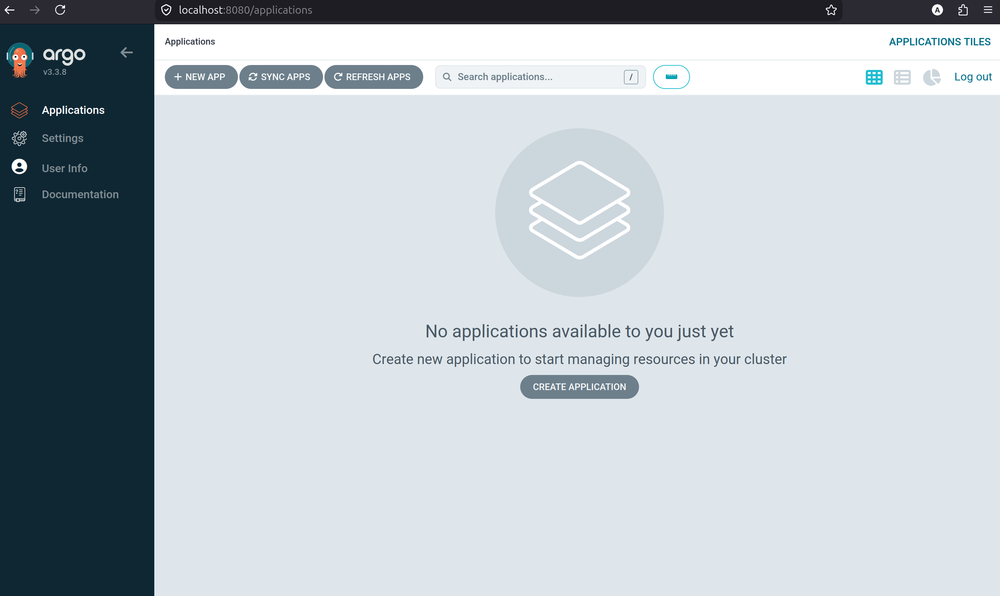
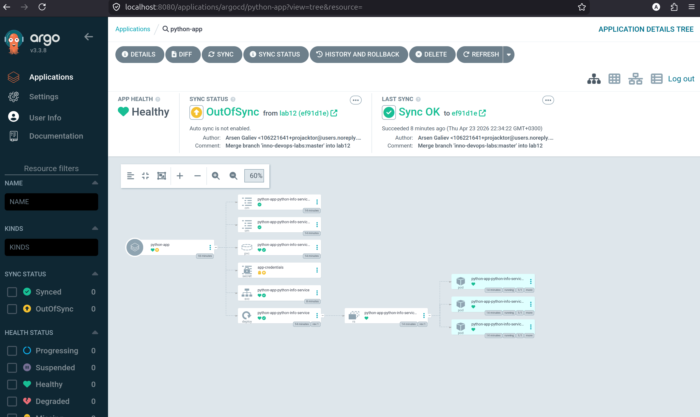
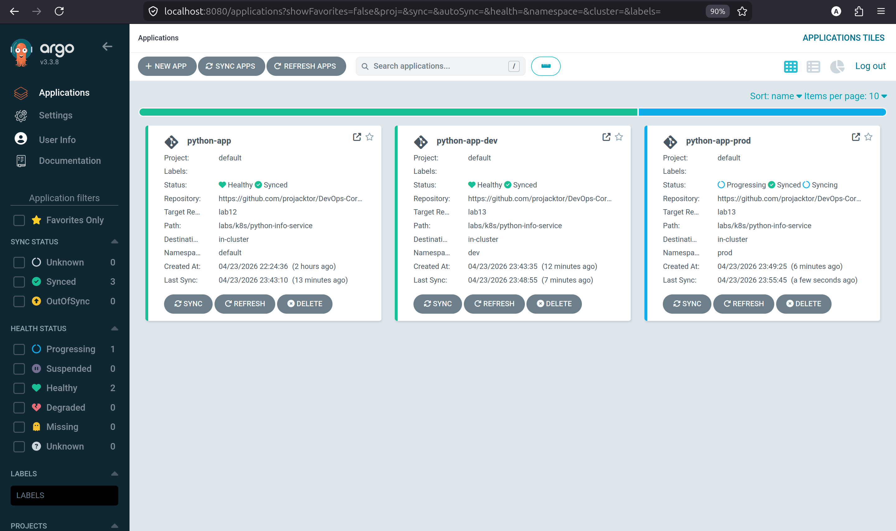

# ArgoCD assgnement

## Task 1 installation

1) Installing ArgoCD into Helm:

```bash
helm repo add argo https://argoproj.github.io/argo-helm
helm repo update

kubectl create namespace argocd
helm install argocd argo/argo-cd --namespace argocd

kubectl wait --for=condition=ready pod -l app.kubernetes.io/name=argocd-server -n argocd --timeout=120s
```

2) Getting to the ArgoCD web

```bash
kubectl -n argocd get secret argocd-initial-admin-secret -o jsonpath="{.data.password}" | base64 -d
# new terminal
kubectl port-forward svc/argocd-server -n argocd 8080:443
```



3) CLI install

Go to https://argo-cd.readthedocs.io/en/stable/cli_installation/

```bash
curl -sSL -o argocd-linux-amd64 https://github.com/argoproj/argo-cd/releases/latest/download/argocd-linux-amd64
sudo install -m 555 argocd-linux-amd64 /usr/local/bin/argocd
rm argocd-linux-amd64

argocd login localhost:8080 --insecure
```

Installation verification

```bash
kubectl get pods -n argocd
kubectl get svc -n argocd
argocd version
argocd account get-user-info
```

Expected result:
- `argocd-server` pod is `Running`
- ArgoCD services are created in `argocd` namespace
- CLI is installed and authenticated as `admin`

## Task 2 ArgoCD deployment

1) ArgoCD deployment at [application.yaml](./argocd/application.yaml)

lab12 set as a `targetRevision`

2) Application of manifest:

```bash
kubectl apply -f k8s/argocd/application.yaml

application.argoproj.io/python-app configured

argocd app sync python-app
TIMESTAMP                  GROUP        KIND              NAMESPACE                  NAME                     STATUS    HEALTH        HOOK  MESSAGE
2026-04-23T22:34:01+03:00          ConfigMap                default  python-app-python-info-service-env       Synced                        
2026-04-23T22:34:01+03:00         PersistentVolumeClaim     default  python-app-python-info-service-data      Synced   Healthy              
2026-04-23T22:34:01+03:00             Secret                default       app-credentials                     Synced                        
2026-04-23T22:34:01+03:00            Service                default  python-app-python-info-service         OutOfSync  Missing              
2026-04-23T22:34:01+03:00   apps  Deployment                default  python-app-python-info-service           Synced   Healthy              
2026-04-23T22:34:01+03:00          ConfigMap                default  python-app-python-info-service-config    Synced                        
2026-04-23T22:34:02+03:00  batch         Job     default  python-app-python-info-service-pre-install            Progressing              
2026-04-23T22:34:04+03:00  batch         Job     default  python-app-python-info-service-pre-install   Running   Synced     PreSync  job.batch/python-app-python-info-service-pre-install created
2026-04-23T22:34:11+03:00            Service     default  python-app-python-info-service    Synced  Healthy              
2026-04-23T22:34:13+03:00         PersistentVolumeClaim     default  python-app-python-info-service-data           Synced   Healthy              persistentvolumeclaim/python-app-python-info-service-data unchanged
2026-04-23T22:34:13+03:00            Service                default  python-app-python-info-service                Synced   Healthy              service/python-app-python-info-service created
2026-04-23T22:34:13+03:00   apps  Deployment                default  python-app-python-info-service                Synced   Healthy              deployment.apps/python-app-python-info-service unchanged
2026-04-23T22:34:13+03:00  batch         Job                default  python-app-python-info-service-pre-install  Succeeded   Synced     PreSync  Reached expected number of succeeded pods
2026-04-23T22:34:13+03:00             Secret                default       app-credentials                          Synced                        secret/app-credentials unchanged
2026-04-23T22:34:13+03:00          ConfigMap                default  python-app-python-info-service-config         Synced                        configmap/python-app-python-info-service-config unchanged
2026-04-23T22:34:13+03:00          ConfigMap                default  python-app-python-info-service-env            Synced                        configmap/python-app-python-info-service-env unchanged
2026-04-23T22:34:13+03:00  batch         Job     default  python-app-python-info-service-post-install   Running   Synced    PostSync  job.batch/python-app-python-info-service-post-install created
2026-04-23T22:34:22+03:00  batch         Job     default  python-app-python-info-service-post-install  Succeeded   Synced    PostSync  Reached expected number of succeeded pods

Name:               argocd/python-app
Project:            default
Server:             https://kubernetes.default.svc
Namespace:          default
URL:                https://argocd.example.com/applications/python-app
Source:
- Repo:             https://github.com/projacktor/DevOps-Core-Course.git
  Target:           lab12
  Path:             labs/k8s/python-info-service
  Helm Values:      values.yaml
SyncWindow:         Sync Allowed
Sync Policy:        Manual
Sync Status:        Synced to lab12 (ef91d1e)
Health Status:      Healthy

Operation:          Sync
Sync Revision:      ef91d1e0362a0dc618222a397e5ca3829b43f317
Phase:              Succeeded
Start:              2026-04-23 22:34:02 +0300 MSK
Finished:           2026-04-23 22:34:22 +0300 MSK
Duration:           20s
Message:            successfully synced (no more tasks)

GROUP  KIND                   NAMESPACE  NAME                                         STATUS     HEALTH   HOOK      MESSAGE
batch  Job                    default    python-app-python-info-service-pre-install   Succeeded           PreSync   Reached expected number of succeeded pods
       Secret                 default    app-credentials                              Synced                        secret/app-credentials unchanged
       ConfigMap              default    python-app-python-info-service-config        Synced                        configmap/python-app-python-info-service-config unchanged
       ConfigMap              default    python-app-python-info-service-env           Synced                        configmap/python-app-python-info-service-env unchanged
       PersistentVolumeClaim  default    python-app-python-info-service-data          Synced     Healthy            persistentvolumeclaim/python-app-python-info-service-data unchanged
       Service                default    python-app-python-info-service               Synced     Healthy            service/python-app-python-info-service created
apps   Deployment             default    python-app-python-info-service               Synced     Healthy            deployment.apps/python-app-python-info-service unchanged
batch  Job                    default    python-app-python-info-service-post-install  Succeeded           PostSync  Reached expected number of succeeded pods
```

Verify

```bash
argocd app sync python-app
TIMESTAMP                  GROUP        KIND              NAMESPACE                  NAME                     STATUS    HEALTH        HOOK  MESSAGE
2026-04-23T22:34:01+03:00          ConfigMap                default  python-app-python-info-service-env       Synced                        
2026-04-23T22:34:01+03:00         PersistentVolumeClaim     default  python-app-python-info-service-data      Synced   Healthy              
2026-04-23T22:34:01+03:00             Secret                default       app-credentials                     Synced                        
2026-04-23T22:34:01+03:00            Service                default  python-app-python-info-service         OutOfSync  Missing              
2026-04-23T22:34:01+03:00   apps  Deployment                default  python-app-python-info-service           Synced   Healthy              
2026-04-23T22:34:01+03:00          ConfigMap                default  python-app-python-info-service-config    Synced                        
2026-04-23T22:34:02+03:00  batch         Job     default  python-app-python-info-service-pre-install            Progressing              
2026-04-23T22:34:04+03:00  batch         Job     default  python-app-python-info-service-pre-install   Running   Synced     PreSync  job.batch/python-app-python-info-service-pre-install created
2026-04-23T22:34:11+03:00            Service     default  python-app-python-info-service    Synced  Healthy              
2026-04-23T22:34:13+03:00         PersistentVolumeClaim     default  python-app-python-info-service-data           Synced   Healthy              persistentvolumeclaim/python-app-python-info-service-data unchanged
2026-04-23T22:34:13+03:00            Service                default  python-app-python-info-service                Synced   Healthy              service/python-app-python-info-service created
2026-04-23T22:34:13+03:00   apps  Deployment                default  python-app-python-info-service                Synced   Healthy              deployment.apps/python-app-python-info-service unchanged
2026-04-23T22:34:13+03:00  batch         Job                default  python-app-python-info-service-pre-install  Succeeded   Synced     PreSync  Reached expected number of succeeded pods
2026-04-23T22:34:13+03:00             Secret                default       app-credentials                          Synced                        secret/app-credentials unchanged
2026-04-23T22:34:13+03:00          ConfigMap                default  python-app-python-info-service-config         Synced                        configmap/python-app-python-info-service-config unchanged
2026-04-23T22:34:13+03:00          ConfigMap                default  python-app-python-info-service-env            Synced                        configmap/python-app-python-info-service-env unchanged
2026-04-23T22:34:13+03:00  batch         Job     default  python-app-python-info-service-post-install   Running   Synced    PostSync  job.batch/python-app-python-info-service-post-install created
2026-04-23T22:34:22+03:00  batch         Job     default  python-app-python-info-service-post-install  Succeeded   Synced    PostSync  Reached expected number of succeeded pods

Name:               argocd/python-app
Project:            default
Server:             https://kubernetes.default.svc
Namespace:          default
URL:                https://argocd.example.com/applications/python-app
Source:
- Repo:             https://github.com/projacktor/DevOps-Core-Course.git
  Target:           lab12
  Path:             labs/k8s/python-info-service
  Helm Values:      values.yaml
SyncWindow:         Sync Allowed
Sync Policy:        Manual
Sync Status:        Synced to lab12 (ef91d1e)
Health Status:      Healthy

Operation:          Sync
Sync Revision:      ef91d1e0362a0dc618222a397e5ca3829b43f317
Phase:              Succeeded
Start:              2026-04-23 22:34:02 +0300 MSK
Finished:           2026-04-23 22:34:22 +0300 MSK
Duration:           20s
Message:            successfully synced (no more tasks)

GROUP  KIND                   NAMESPACE  NAME                                         STATUS     HEALTH   HOOK      MESSAGE
batch  Job                    default    python-app-python-info-service-pre-install   Succeeded           PreSync   Reached expected number of succeeded pods
       Secret                 default    app-credentials                              Synced                        secret/app-credentials unchanged
       ConfigMap              default    python-app-python-info-service-config        Synced                        configmap/python-app-python-info-service-config unchanged
       ConfigMap              default    python-app-python-info-service-env           Synced                        configmap/python-app-python-info-service-env unchanged
       PersistentVolumeClaim  default    python-app-python-info-service-data          Synced     Healthy            persistentvolumeclaim/python-app-python-info-service-data unchanged
       Service                default    python-app-python-info-service               Synced     Healthy            service/python-app-python-info-service created
apps   Deployment             default    python-app-python-info-service               Synced     Healthy            deployment.apps/python-app-python-info-service unchanged
batch  Job                    default    python-app-python-info-service-post-install  Succeeded           PostSync  Reached expected number of succeeded pods
```



## Task 3 prod-dev

1) Namespace making

```bash
kubectl create namespace dev
kubectl create namespace prod
```

2) Manifests at [prod](./argocd/application-prod.yaml) & [dev](./argocd/application-dev.yaml)

Application configuration summary:
- [application-dev.yaml](./argocd/application-dev.yaml): `python-app-dev` from `lab13`, values file `values-dev.yaml`, destination namespace `dev`
- [application-prod.yaml](./argocd/application-prod.yaml): `python-app-prod` from `lab13`, values file `values-prod.yaml`, destination namespace `prod`
- Both applications use the same Helm chart path: `labs/k8s/python-info-service`

3) Verification of deploying

```bash
kubectl get pods -n dev
kubectl get pods -n prod
argocd app list

kubectl get pods -n dev
                                                              kubectl get pods -n prod
                                                              argocd app list
NAME                                                  READY   STATUS    RESTARTS   AGE
python-app-dev-python-info-service-689cb4bf44-sjwgn   1/1     Running   0          12m
NAME                                                   READY   STATUS    RESTARTS   AGE
python-app-prod-python-info-service-5dd5f857b9-2nl56   1/1     Running   0          2m11s
python-app-prod-python-info-service-5dd5f857b9-m9k4b   1/1     Running   0          2m44s
python-app-prod-python-info-service-5dd5f857b9-p8tk9   1/1     Running   0          2m33s
python-app-prod-python-info-service-5dd5f857b9-tj8tl   1/1     Running   0          2m22s
python-app-prod-python-info-service-5dd5f857b9-xk4gn   1/1     Running   0          2m55s
NAME                    CLUSTER                         NAMESPACE  PROJECT  STATUS  HEALTH       SYNCPOLICY  CONDITIONS  REPO                                                  PATH                          TARGET
argocd/python-app       https://kubernetes.default.svc  default    default  Synced  Healthy      Manual      <none>      https://github.com/projacktor/DevOps-Core-Course.git  labs/k8s/python-info-service  lab12
argocd/python-app-dev   https://kubernetes.default.svc  dev        default  Synced  Healthy      Auto-Prune  <none>      https://github.com/projacktor/DevOps-Core-Course.git  labs/k8s/python-info-service  lab13
argocd/python-app-prod  https://kubernetes.default.svc  prod       default  Synced  Progressing  Manual      <none>      https://github.com/projacktor/DevOps-Core-Course.git  labs/k8s/python-info-service  lab13
```



Environment differences:
- `dev` uses [values-dev.yaml](./python-info-service/values-dev.yaml): `replicaCount: 1`, `NodePort: 30081`, lighter resources, `image.tag: latest`
- `prod` uses [values-prod.yaml](./python-info-service/values-prod.yaml): `replicaCount: 5`, `LoadBalancer`, higher resources, `image.tag: latest`
- Namespaces are separated: dev resources are deployed to `dev`, prod resources are deployed to `prod`

Sync policy differences and rationale:
- `dev` uses automated sync with `prune: true` and `selfHeal: true`
- `prod` uses manual sync
- Rationale: `dev` is convenient for fast iteration and drift correction, while `prod` requires explicit sync to avoid accidental changes

UI screenshots to include:
- ArgoCD UI showing both applications
- Sync status overview
- Application details page for one of the apps

## Task 4 self-heal

```bash
kubectl get deployments -n dev
NAME                                 READY   UP-TO-DATE   AVAILABLE   AGE
python-app-dev-python-info-service   1/1     1            1           17m

argocd app get python-app-dev
Name:               argocd/python-app-dev
Project:            default
Server:             https://kubernetes.default.svc
Namespace:          dev
URL:                https://argocd.example.com/applications/python-app-dev
Source:
- Repo:             https://github.com/projacktor/DevOps-Core-Course.git
  Target:           lab13
  Path:             labs/k8s/python-info-service
  Helm Values:      values-dev.yaml
SyncWindow:         Sync Allowed
Sync Policy:        Automated (Prune)
Sync Status:        Synced to lab13 (e61aa26)
Health Status:      Healthy

GROUP  KIND                   NAMESPACE  NAME                                             STATUS     HEALTH   HOOK      MESSAGE
batch  Job                    dev        python-app-dev-python-info-service-pre-install   Succeeded           PreSync   Reached expected number of succeeded pods
       Secret                 dev        app-credentials                                  Synced                        secret/app-credentials unchanged
       ConfigMap              dev        python-app-dev-python-info-service-config        Synced                        configmap/python-app-dev-python-info-service-config unchanged
       ConfigMap              dev        python-app-dev-python-info-service-env           Synced                        configmap/python-app-dev-python-info-service-env unchanged
       PersistentVolumeClaim  dev        python-app-dev-python-info-service-data          Synced     Healthy            persistentvolumeclaim/python-app-dev-python-info-service-data unchanged
       Service                dev        python-app-dev-python-info-service               Synced     Healthy            service/python-app-dev-python-info-service unchanged
apps   Deployment             dev        python-app-dev-python-info-service               Synced     Healthy            deployment.apps/python-app-dev-python-info-service configured
batch  Job                    dev        python-app-dev-python-info-service-post-install  Succeeded           PostSync  Reached expected number of succeeded pods
```

Pod deletion test

```bash
kubectl get pods -n dev --show-labels
                                                  kubectl delete pod -n dev -l app.kubernetes.io/name=python-info-service

NAME                                                  READY   STATUS    RESTARTS   AGE   LABELS
python-app-dev-python-info-service-689cb4bf44-sjwgn   1/1     Running   0          18m   app.kubernetes.io/instance=python-app-dev,app.kubernetes.io/name=python-info-service,app=python-info-service,pod-template-hash=689cb4bf44
pod "python-app-dev-python-info-service-689cb4bf44-sjwgn" deleted from dev namespace
projacktor@projacktorLaptop ~/P/e/D/labs (lab13)> kubectl get pods -n dev
NAME                                                  READY   STATUS    RESTARTS   AGE
python-app-dev-python-info-service-689cb4bf44-nhrkh   1/1     Running   0          11s
```

Explanation:
- Pod recreation after deletion is handled first by the Kubernetes Deployment controller
- ArgoCD still observes the application and keeps the declared state healthy
- This test shows workload recovery, but it is not the best drift example for ArgoCD because pod replacement is native Kubernetes behavior

Manual scale drift test

```bash
kubectl get deployment python-app-dev-python-info-service -n dev
kubectl scale deployment python-app-dev-python-info-service -n dev --replicas=5
kubectl get deployment python-app-dev-python-info-service -n dev -w
argocd app get python-app-dev
```

Expected behavior:
- The Deployment can be scaled manually from `1` to `5`
- Because `python-app-dev` has automated sync and self-heal enabled, ArgoCD detects the drift
- ArgoCD reconciles the Deployment back to the value from `values-dev.yaml`, which is `replicaCount: 1`

Configuration drift test

```bash
argocd app diff python-app-dev
kubectl patch deployment python-app-dev-python-info-service -n dev --type merge -p '{"spec":{"replicas":3}}'
argocd app diff python-app-dev
argocd app get python-app-dev
```

Expected behavior:
- Before manual change, `argocd app diff python-app-dev` returns no diff
- After patching the Deployment, ArgoCD detects drift between live state and Git state
- Because self-heal is enabled in dev, ArgoCD restores the Deployment to the value declared in Git
