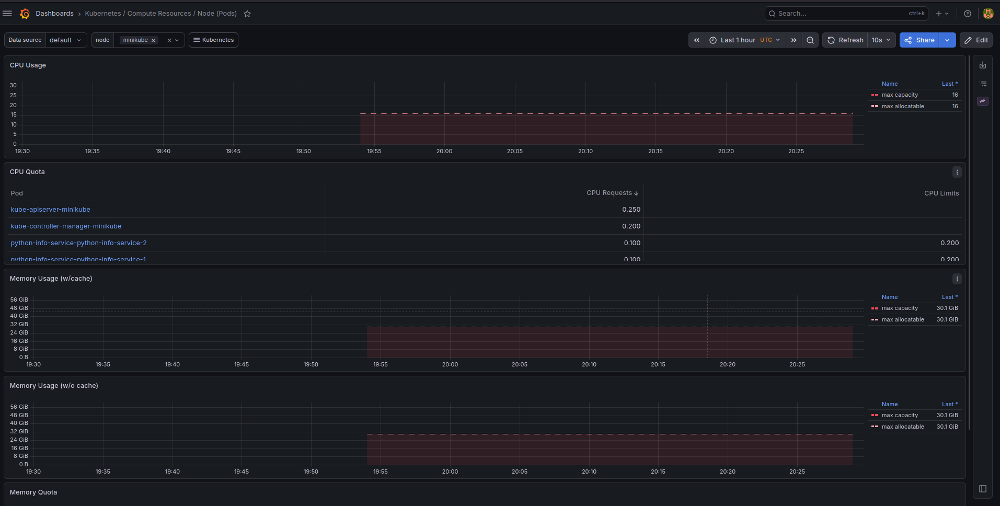
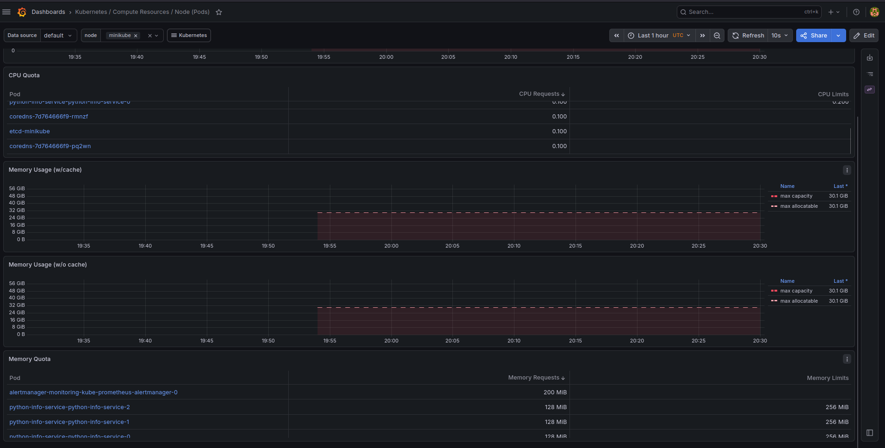
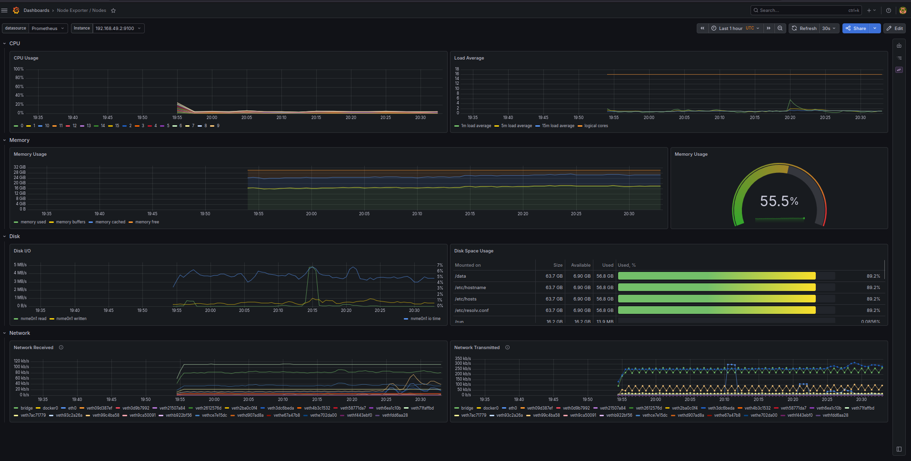
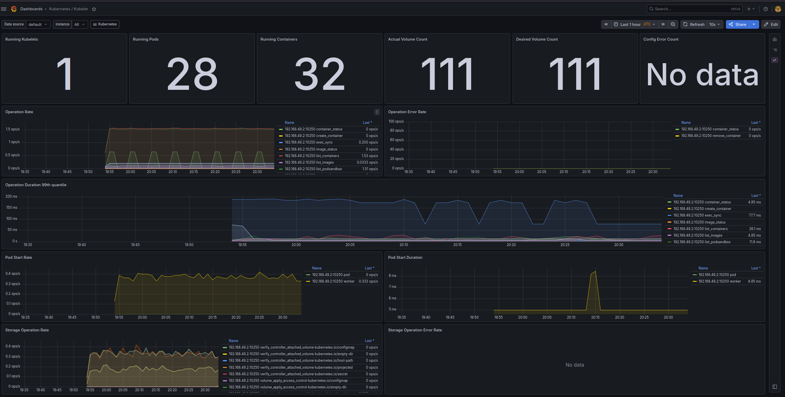
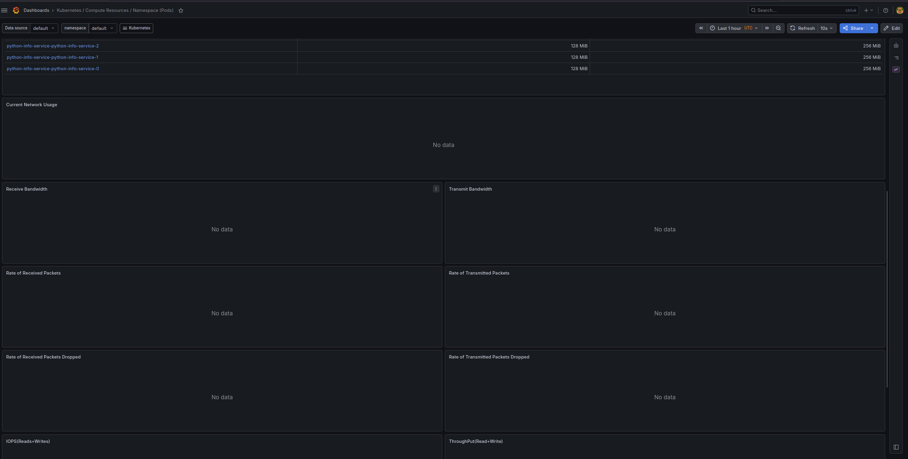
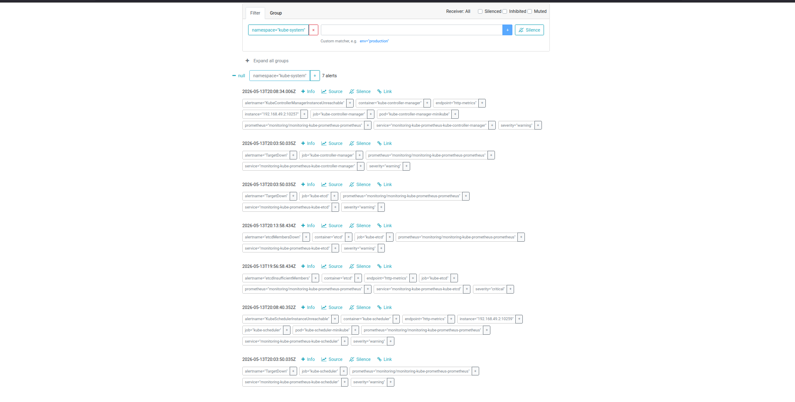
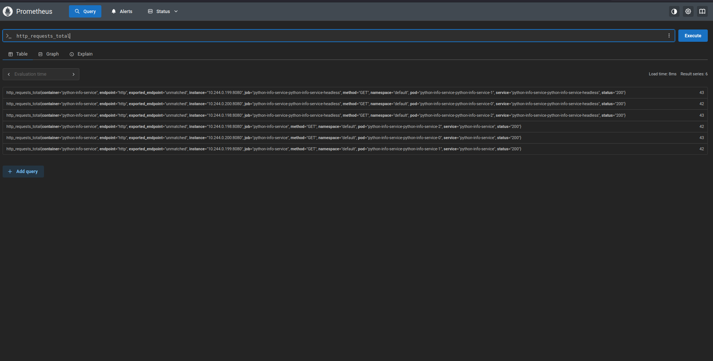

# monitoring/image with PGL stack for k8s

## Task 1

Components tasks:

- Prometheus Operator - monitoring/image containers deploymnet automation
- Prometheus itself collects metrics from k8s objects and stores them
- Alertmanager alerts about events in the system
- Grafana for metrics and logs visualization
- kube-state-metrics generates and orginizes data for metrics of k8s objects for Prometheus
- node-exporter collects metrics of linux host machines for Prometheus

Installation
```sh
helm repo add prometheus-community https://prometheus-communit
y.github.io/helm-charts
"prometheus-community" has been added to your repositories

helm repo update
Hang tight while we grab the latest from your chart repositories...
...Successfully got an update from the "hashicorp" chart repository
...Successfully got an update from the "argo" chart repository
...Successfully got an update from the "prometheus-community" chart repository
Update Complete. ⎈Happy Helming!⎈

helm install monitoring/image prometheus-community/kube-prometheus-s
tack \
                                                                    --namespace monitoring/image \
                                                                    --create-namespace
level=WARN msg="unable to find exact version; falling back to closest available version" chart=kube-prometheus-stack requested="" selected=85.0.2
NAME: monitoring/image
LAST DEPLOYED: Wed May 13 22:50:20 2026
NAMESPACE: monitoring/image
STATUS: deployed
REVISION: 1
DESCRIPTION: Install complete
TEST SUITE: None
NOTES:
kube-prometheus-stack has been installed. Check its status by running:
  kubectl --namespace monitoring/image get pods -l "release=monitoring/image"

Get Grafana 'admin' user password by running:

  kubectl --namespace monitoring/image get secrets monitoring/image-grafana -o jsonpath="{.data.admin-password}" | base64 -d ; echo

Access Grafana local instance:

  export POD_NAME=$(kubectl --namespace monitoring/image get pod -l "app.kubernetes.io/name=grafana,app.kubernetes.io/instance=monitoring/image" -oname)
  kubectl --namespace monitoring/image port-forward $POD_NAME 3000

Get your grafana admin user password by running:

  kubectl get secret --namespace monitoring/image -l app.kubernetes.io/component=admin-secret -o jsonpath="{.items[0].data.admin-password}" | base64 --decode ; echo


Visit https://github.com/prometheus-operator/kube-prometheus for instructions on how to create & configure Alertmanager and Prometheus instances using the Operator.

kubectl get pods -n monitoring/image
NAME                                                     READY   STATUS    RESTARTS   AGE
alertmanager-monitoring/image-kube-prometheus-alertmanager-0   2/2     Running   0          4m9s
monitoring/image-grafana-fc5456745-8gn9c                       3/3     Running   0          4m36s
monitoring/image-kube-prometheus-operator-56dfc8596-dhs4s      1/1     Running   0          4m36s
monitoring/image-kube-state-metrics-5957bd45bc-2f7g7           1/1     Running   0          4m36s
monitoring/image-prometheus-node-exporter-2mk55                1/1     Running   0          4m36s
prometheus-monitoring/image-kube-prometheus-prometheus-0       2/2     Running   0          4m9s

kubectl get po,svc -n monitoring
NAME                                                         READY   STATUS    RESTARTS   AGE
pod/alertmanager-monitoring-kube-prometheus-alertmanager-0   2/2     Running   0          108m
pod/monitoring-grafana-fc5456745-8gn9c                       3/3     Running   0          109m
pod/monitoring-kube-prometheus-operator-56dfc8596-dhs4s      1/1     Running   0          109m
pod/monitoring-kube-state-metrics-5957bd45bc-2f7g7           1/1     Running   0          109m
pod/monitoring-prometheus-node-exporter-2mk55                1/1     Running   0          109m
pod/prometheus-monitoring-kube-prometheus-prometheus-0       2/2     Running   0          108m

NAME                                              TYPE        CLUSTER-IP       EXTERNAL-IP   PORT(S)                      AGE
service/alertmanager-operated                     ClusterIP   None             <none>        9093/TCP,9094/TCP,9094/UDP   108m
service/monitoring-grafana                        ClusterIP   10.107.73.195    <none>        80/TCP                       109m
service/monitoring-kube-prometheus-alertmanager   ClusterIP   10.103.196.145   <none>        9093/TCP,8080/TCP            109m
service/monitoring-kube-prometheus-operator       ClusterIP   10.106.19.145    <none>        443/TCP                      109m
service/monitoring-kube-prometheus-prometheus     ClusterIP   10.97.51.12      <none>        9090/TCP,8080/TCP            109m
service/monitoring-kube-state-metrics             ClusterIP   10.108.164.215   <none>        8080/TCP                     109m
service/monitoring-prometheus-node-exporter       ClusterIP   10.110.207.158   <none>        9100/TCP                     109m
service/prometheus-operated                       ClusterIP   None             <none>        9090/TCP                     108m
```

## Task 2
1) 



2) All of them use equal CPU amount


3) 

4) Pods: 28, Containers: 32


5) No data on dashboard (cAdvisor container network metrics are missing/not scraped)



6) 7 alerts all




## Task 3

Init-download file on [init-demo.yaml](./init-demo.yaml)

```sh
kubectl logs init-demo -c init-download
Connecting to example.com (172.66.147.243:443)
wget: note: TLS certificate validation not implemented
saving to '/work-dir/index.html'
index.html           100% |********************************|   528  0:00:00 ETA
'/work-dir/index.html' saved

kubectl exec init-demo -- cat /data/index.html
Defaulted container "main-app" out of: main-app, init-download (init), wait-for-service (init)
<!doctype html><html lang="en"><head><title>Example Domain</title><meta name="viewport" content="width=device-width, initial-scale=1"><style>body{background:#eee;width:60vw;margin:15vh auto;font-family:system-ui,sans-serif}h1{font-size:1.5em}div{opacity:0.8}a:link,a:visited{color:#348}</style></head><body><div><h1>Example Domain</h1><p>This domain is for use in documentation examples without needing permission. Avoid use in operations.</p><p><a href="https://iana.org/domains/example">Learn more</a></p></div></body></html>
```

Wait-for-service file on [init-wait-demo.yaml](./init-wait-demo.yaml)

```sh
kubectl apply -f init-wait-demo.yaml
pod/init-wait-demo created

kubectl create service clusterip myservice --tcp=80:
80
service/myservice created

kubectl get pods -w
NAME                                        READY   STATUS     RESTARTS        AGE
init-demo                                   0/1     Init:1/2   0               9m30s
init-wait-demo                              1/1     Running    0               9s
python-info-service-python-info-service-0   1/1     Running    1 (6d22h ago)   6d22h
python-info-service-python-info-service-1   1/1     Running    1 (6d22h ago)   6d23h
python-info-service-python-info-service-2   1/1     Running    1 (6d22h ago)   6d23h
vault-0                                     1/1     Running    6 (6d22h ago)   34d
vault-agent-injector-848dd747d7-dkf66       1/1     Running    7 (6d22h ago)   34d
```

## Bonus

I created simple [metrics.yaml](./metrics.yaml) for shortened [service.yaml](./service.yaml), applied it:

```sh
kubectl apply -f metrics.yaml -n monitoring
servicemonitor.monitoring.coreos.com/myapp-monitor created

kubectl get servicemonitors.monitoring.coreos.com -n monitoring
NAME                                                 AGE
monitoring-grafana                                   120m
monitoring-kube-prometheus-alertmanager              120m
monitoring-kube-prometheus-apiserver                 120m
monitoring-kube-prometheus-coredns                   120m
monitoring-kube-prometheus-kube-controller-manager   120m
monitoring-kube-prometheus-kube-etcd                 120m
monitoring-kube-prometheus-kube-proxy                120m
monitoring-kube-prometheus-kube-scheduler            120m
monitoring-kube-prometheus-kubelet                   120m
monitoring-kube-prometheus-operator                  120m
monitoring-kube-prometheus-prometheus                120m
monitoring-kube-state-metrics                        120m
monitoring-prometheus-node-exporter                  120m
myapp-monitor                                        4s

kubectl get endpoints python-info-service
Warning: v1 Endpoints is deprecated in v1.33+; use discovery.k8s.io/v1 EndpointSlice
NAME                  ENDPOINTS                                               AGE
python-info-service   10.244.0.198:8080,10.244.0.199:8080,10.244.0.200:8080   4m45s
```

and got metrics:

