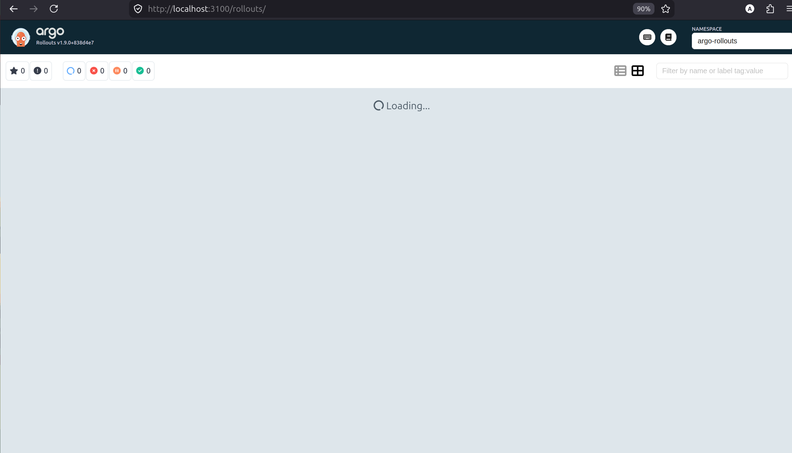
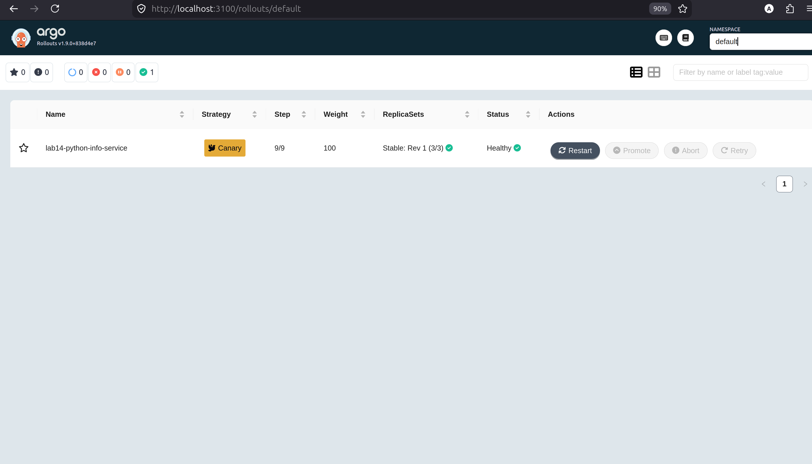
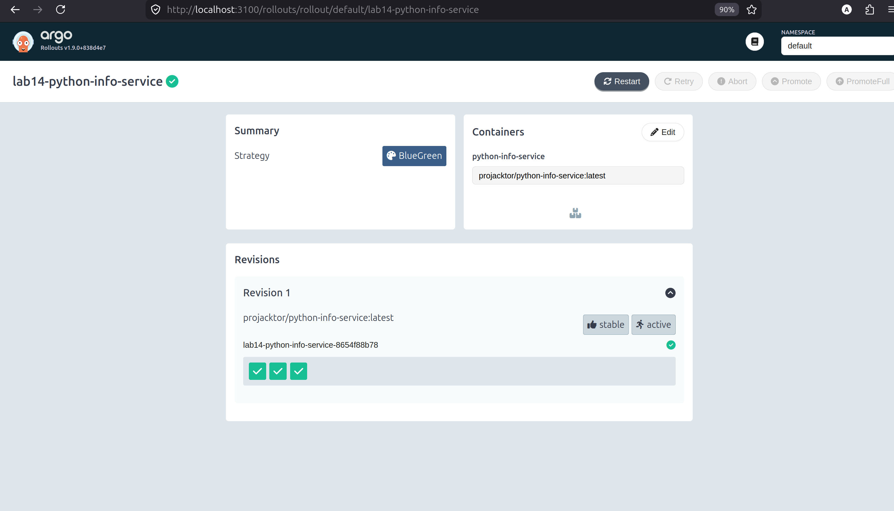
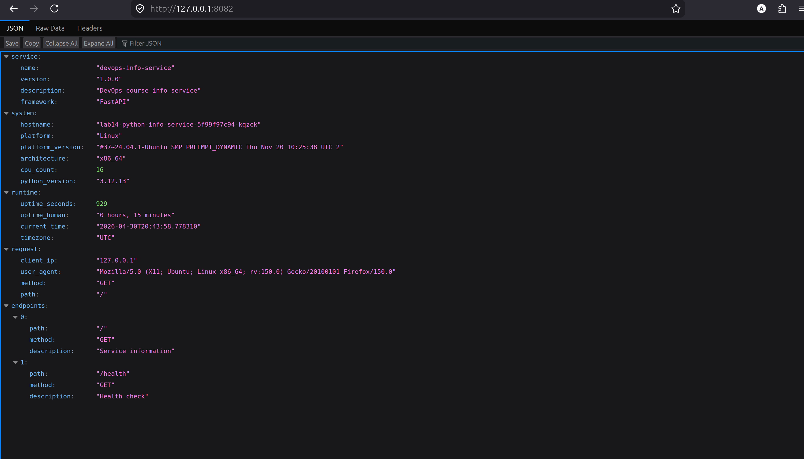

# ArgoCD rollouts

## Task 1

- Installation verification

```bash
chmod +x kubectl-argo-rollouts-linux-amd64
sudo mv kubectl-argo-rollouts-linux-amd64 /usr/local/bin/kubectl-argo-rollouts
kubectl argo rollouts version

kubectl-argo-rollouts: v1.9.0+838d4e7
  BuildDate: 2026-03-20T21:08:11Z
  GitCommit: 838d4e792be666ec11bd0c80331e0c5511b5010e
  GitTreeState: clean
  GoVersion: go1.24.13
  Compiler: gc
  Platform: linux/amd64
```




## Task 2

1) Rollout file header ([rollout.yaml](./python-info-service/templates/rollout-canary.yaml)):

```yaml
apiVersion: argoproj.io/v1alpha1
kind: Rollout
metadata:
  name: {{ include "python-info-service.fullname" . }}
  labels:
    {{- include "python-info-service.labels" . | nindent 4 }}
spec:
  replicas: {{ .Values.replicaCount }}
  selector:
    matchLabels:
      {{- include "python-info-service.selectorLabels" . | nindent 6 }}
  template:
    metadata:
      labels:

      # <so on>
```

2) Testing

```bash
kubectl argo rollouts get rollout lab14-python-info-service -w

Name:            lab14-python-info-service
Namespace:       default
Status:          ✔ Healthy
Strategy:        Canary
  Step:          9/9
  SetWeight:     100
  ActualWeight:  100
Images:          projacktor/python-info-service:latest (stable)
Replicas:
  Desired:       3
  Current:       3
  Updated:       3
  Ready:         3
  Available:     3

NAME                                                   KIND        STATUS     AGE  INFO
⟳ lab14-python-info-service                            Rollout     ✔ Healthy  76s  
└──# revision:1                                                                    
   └──⧉ lab14-python-info-service-8654f88b78           ReplicaSet  ✔ Healthy  76s  stable
      ├──□ lab14-python-info-service-8654f88b78-4glbk  Pod         ✔ Running  76s  ready:1/1
      ├──□ lab14-python-info-service-8654f88b78-9k45b  Pod         ✔ Running  76s  ready:1/1
      └──□ lab14-python-info-service-8654f88b78-w2vdj  Pod         ✔ Running  76s  ready:1/1
```



```bash
kubectl argo rollouts promote lab14-python-info-service
rollout 'lab14-python-info-service' promoted

kubectl argo rollouts abort lab14-python-info-service
rollout 'lab14-python-info-service' aborted

kubectl argo rollouts retry rollout lab14-python-info-service
rollout 'lab14-python-info-service' retried

kubectl argo rollouts get rollout lab14-python-info-service -w


Name:            lab14-python-info-service
Namespace:       default
Status:          ✔ Healthy
Strategy:        Canary
  Step:          9/9
  SetWeight:     100
  ActualWeight:  100
Images:          projacktor/python-info-service:latest (stable)
Replicas:
  Desired:       3
  Current:       3
  Updated:       3
  Ready:         3
  Available:     3

NAME                                                   KIND        STATUS     AGE    INFO
⟳ lab14-python-info-service                            Rollout     ✔ Healthy  2m50s  
└──# revision:1                                                                      
   └──⧉ lab14-python-info-service-8654f88b78           ReplicaSet  ✔ Healthy  2m50s  stable
      ├──□ lab14-python-info-service-8654f88b78-4glbk  Pod         ✔ Running  2m50s  ready:1/1
      ├──□ lab14-python-info-service-8654f88b78-9k45b  Pod         ✔ Running  2m50s  ready:1/1
      └──□ lab14-python-info-service-8654f88b78-w2vdj  Pod         ✔ Running  2m50s  ready:1/1
```

## Task 3

1) New strategy apply at [rollout.yaml](./python-info-service/templates/rollout.yaml):

```yaml
apiVersion: argoproj.io/v1alpha1
kind: Rollout
metadata:
  name: {{ include "python-info-service.fullname" . }}
  labels:
    {{- include "python-info-service.labels" . | nindent 4 }}
spec:
  replicas: {{ .Values.replicaCount }}
  selector:
    matchLabels:
      {{- include "python-info-service.selectorLabels" . | nindent 6 }}
  template:
    metadata:
      labels:

      # so on
```

```bash
Name:            lab14-python-info-service
Namespace:       default
Status:          ✔ Healthy
Strategy:        BlueGreen
Images:          projacktor/python-info-service:latest (stable, active)
Replicas:
  Desired:       3
  Current:       3
  Updated:       3
  Ready:         3
  Available:     3

NAME                                                   KIND        STATUS     AGE  INFO
⟳ lab14-python-info-service                            Rollout     ✔ Healthy  28m  
└──# revision:1                                                                    
   └──⧉ lab14-python-info-service-8654f88b78           ReplicaSet  ✔ Healthy  28m  stable,active
      ├──□ lab14-python-info-service-8654f88b78-4glbk  Pod         ✔ Running  28m  ready:1/1
      ├──□ lab14-python-info-service-8654f88b78-9k45b  Pod         ✔ Running  28m  ready:1/1
      └──□ lab14-python-info-service-8654f88b78-w2vdj  Pod         ✔ Running  28m  ready:1/1
^C⏎                          
```



2) Port forwarding:

```bash
# first

 kubectl port-forward svc/lab14-python-info-service 8081:8080
Forwarding from 127.0.0.1:8081 -> 8080
Handling connection for 8081
E0430 23:41:58.851038   52880 portforward.go:404] "Unhandled Error" err="error copying from local connection to remote stream: writeto tcp4 127.0.0.1:8081->127.0.0.1:49716: read tcp4 127.0.0.1:8081->127.0.0.1:49716: read: connection reset by peer"
Handling connection for 8081
E0430 23:41:58.859546   52880 portforward.go:404] "Unhandled Error" err="error copying from local connection to remote stream: writeto tcp4 127.0.0.1:8081->127.0.0.1:49722: read tcp4 127.0.0.1:8081->127.0.0.1:49722: read: connection reset by peer"
Handling connection for 8081
E0430 23:41:58.867414   52880 portforward.go:404] "Unhandled Error" err="error copying from local connection to remote stream: writeto tcp4 127.0.0.1:8081->127.0.0.1:49732: read tcp4 127.0.0.1:8081->127.0.0.1:49732: read: connection reset by peer"
Handling connection for 8081
Handling connection for 8081
```


```bash
# second

 kubectl port-forward svc/lab14-python-info-service 8082:8080
Forwarding from 127.0.0.1:8082 -> 8080
Handling connection for 8082
Handling connection for 8082
Handling connection for 8082
```



3) Rollout

```bash
kubectl argo rollouts promote lab14-python-info-service
rollout 'lab14-python-info-service' promoted
```

### Comparison

- Blue-Green: Instant switch, all-or-nothing
- Canary: Gradual traffic shift, percentage-based
- Blue-Green: Need 2x resources during deployment
- Canary: Shared resources, mixed traffic

### Rollout vs Deployment

Deployment uses RollingUpdate/Recreate and only supports basic rollout behavior.
Rollout replaces Deployment for progressive delivery and adds canary/blue-green strategies, pauses, manual promotion, abort, retry, preview service, active service, and optional analysis.
