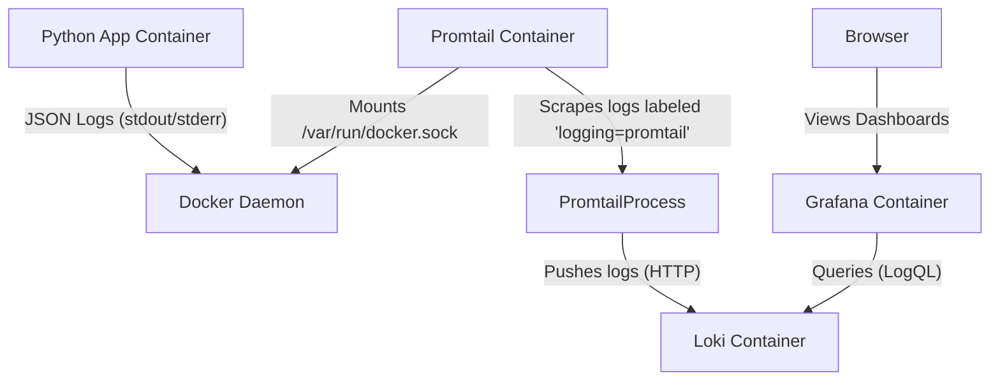
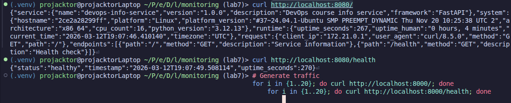
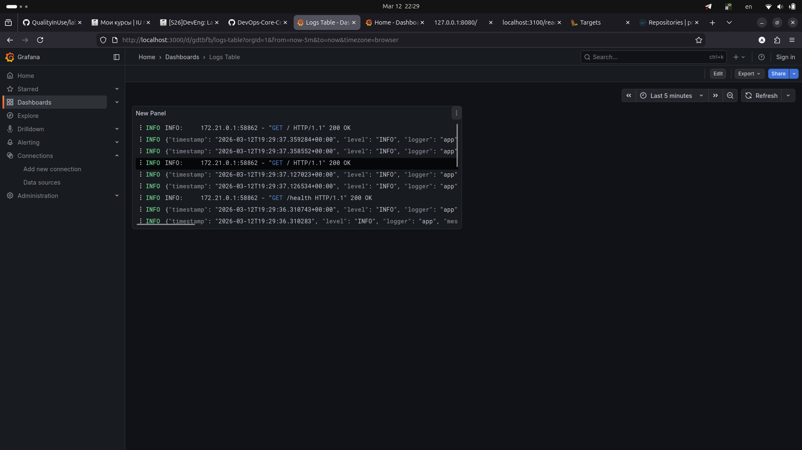
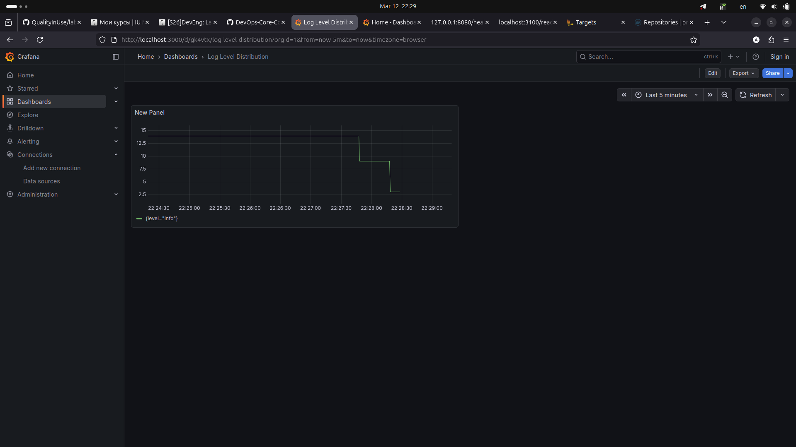
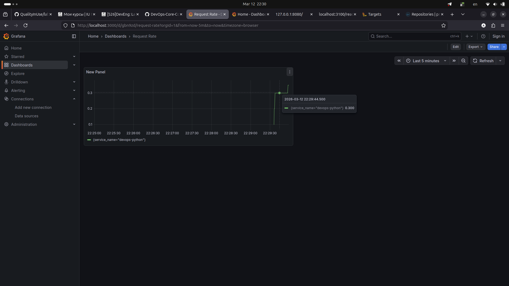
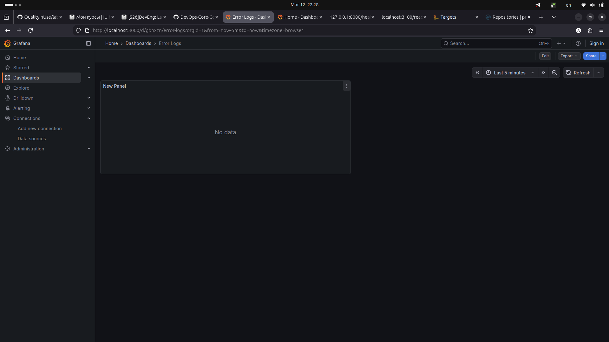
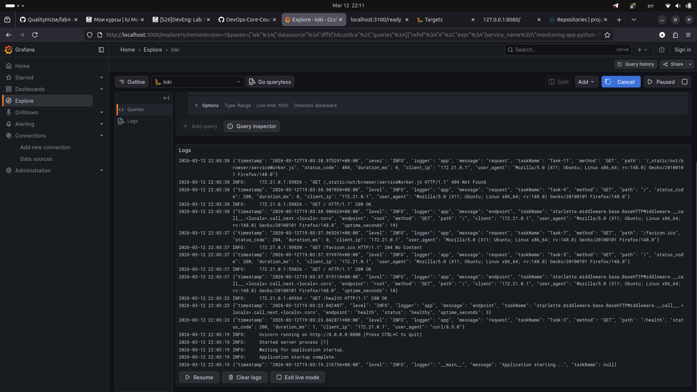
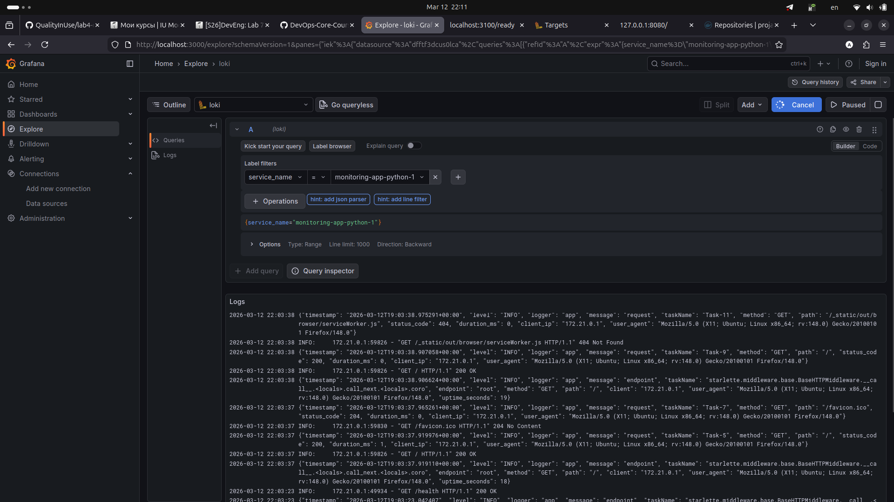
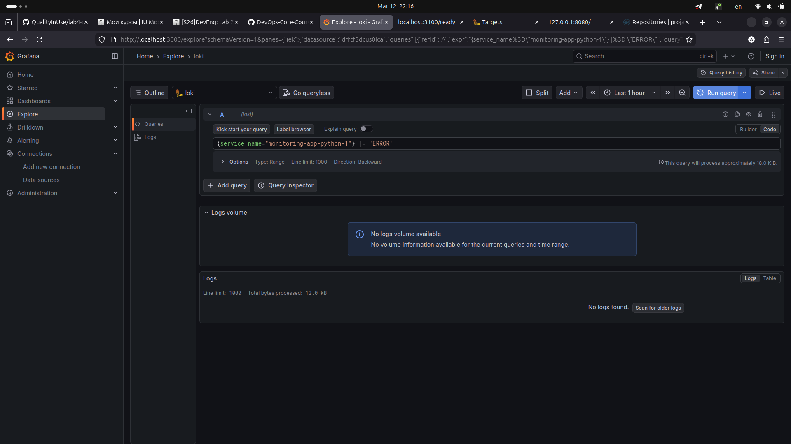
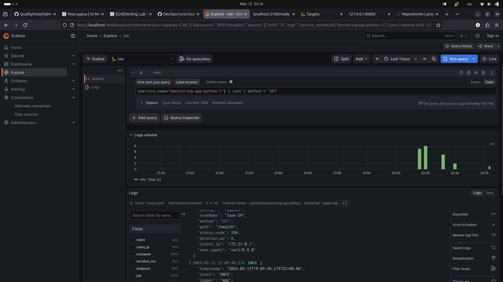

# Monitoring Setup Documentation (Task 5)

## 1. Architecture

The monitoring stack consists of **Loki** (log aggregation), **Promtail** (log collector), and **Grafana** (visualization), monitoring a Python FastAPI application.



**Components:**

- **App**: Generates structured JSON logs.
- **Promtail**: Uses Docker Service Discovery to find containers with the label `logging: "promtail"` and ships their logs to Loki.
- **Loki**: Stores the logs.
- **Grafana**: Connects to Loki to visualize the data.

## 2. Setup Guide

### prerequisites

- Docker and Docker Compose installed.
- Python application image built or available (`projacktor/python-info-service:latest`).

### Step-by-Step Deployment

1.  **Navigate to the monitoring directory**:

    ```bash
    cd monitoring
    ```

2.  **Create `.env` file** (if not exists) with secure credentials:

    ```bash
    cp .env.sample .env
    # Edit .env to set GF_SECURITY_ADMIN_PASSWORD
    ```

3.  **Start the stack**:

    ```bash
    docker compose up -d
    ```

4.  **Verify containers are running**:

    ```bash
    docker compose ps
    ```

    Ensure `loki`, `promtail`, `grafana`, and `app-python` are healthy/up.

5.  **Access Grafana**:
    - Open `http://localhost:3000`.
    - Login with `admin` / `<your_password>`.

6.  **Configure Data Source**:
    - Go to **Connections** -> **Data Sources**.
    - Add **Loki** data source.
    - URL: `http://loki:3100`.
    - Click **Save & Test**.

## 3. Configuration

### Loki (`loki/config.yaml`)

Loki is configured as a single binary for simplicity.

```yaml
auth_enabled: false
server:
  http_listen_port: 3100
schema_config:
  configs:
    - from: 2024-01-01
      store: tsdb
      object_store: filesystem
      schema: v13
...
```

_Why_: We use `filesystem` storage and `tsdb` schema which is efficient for low-volume local setups. `auth_enabled: false` simplifies internal communication between Promtail and Loki within the private Docker network.

### Promtail (`promtail/config.yaml`)

Promtail is configured to discover Docker containers automatically.

```yaml
scrape_configs:
  - job_name: docker
    docker_sd_configs:
      - host: unix:///var/run/docker.sock
        refresh_interval: 5s
    relabel_configs:
      - source_labels: [__meta_docker_container_label_logging]
        regex: "promtail"
        action: keep
      - source_labels: [__meta_docker_container_name]
        regex: "/?(.+)"
        target_label: container
        replacement: "$1"
```

_Why_: The `relabel_configs` are crucial.

1.  `action: keep`: Only scrapes containers with the Docker label `logging=promtail`. This prevents Promtail from ingesting logs from itself, Loki, or Grafana, reducing noise (loops).
2.  `target_label: container`: Cleans up the container name label for better readability in Grafana.

## 4. Application Logging

The Python application sends logs to `stdout` in **JSON format**. This is essential for Loki to easily parse and index fields like `level`, `status_code`, and `path`.

**Implementation (`app.py` code snippet):**

```python
class JSONFormatter(logging.Formatter):
    def format(self, record):
        obj = {
            "timestamp": datetime.fromtimestamp(record.created, timezone.utc).isoformat(),
            "level": record.levelname,
            "logger": record.name,
            "message": record.getMessage(),
        }
        # ... adds extra fields like status_code, path, etc.
        return json.dumps(obj)

handler = logging.StreamHandler()
handler.setFormatter(JSONFormatter())
root_logger.addHandler(handler)
```

**Resulting JSON Output:**


## 5. Dashboard & LogQL

We created a dashboard to monitor application health.

### Panels

1.  **Logs Table**: Shows raw log lines, parsed.
    - _Query_: `{job="docker"}`
    - _Visualization_: Logs view.
      

2.  **Log Level Distribution**: Shows the count of logs per severity level (INFO, WORD, ERROR).
    - _Query_: `sum by (level) (count_over_time({job="docker"} | json [5m]))`
    - _Visualization_: Pie Chart.
      

3.  **Request Rate**: Shows the rate of HTTP requests.
    - _Query_: `rate({job="docker"} | json | method="GET" [1m])`
    - _Visualization_: Time series.
      

4.  **Error Logs**: Filters explicitly for error-level logs.
    - _Query_: `{job="docker"} | json | level="ERROR"`
    - _Visualization_: Logs view (filtered).
      

### LogQL Query Examples

- **Basic log stream**:
  
- **Parsing JSON**: `{job="docker"} | json`
  
- **Filtering for errors**: `{container="devops-python"} |= "error"`
  
- **Counting Logs**:
  

## 6. Production Configuration

For a production environment, the following changes were made/recommended:

1.  **Resource Limits**: Added `deploy.resources` in `compose.yaml` to prevent monitoring tools from consuming all host RAM.
    ```yaml
    loki:
      deploy:
        resources:
          limits:
            memory: 1G
    ```
2.  **Security**:
    - Run containers as non-root users (Loki/Promtail images do this by default).
    - Enable Grafana authentication (changed standard admin/admin).
    - In a real cluster, use TLS for ingestion and querying.
3.  **Retention**: configured `table_manager` in Loki to delete old logs (e.g., 30 days) to save space.
4.  **Storage**: Switch from `filesystem` to an Object Store (S3, GCS) for durability and scalability.

## 7. Testing

To verify the setup:

1.  **Generate normal traffic**:
    ```bash
    curl http://localhost:8080/
    curl http://localhost:8080/health
    ```
2.  **Generate errors** (simulated):
    ```bash
    # Access non-existent endpoint
    curl http://localhost:8080/does-not-exist
    ```
3.  **Check Grafana**:
    - Verify the "Request Rate" panel shows a spike.
    - Verify the "Error Logs" panel shows the 404 error.

## 8. Challenges & Solutions

1.  **Challenge**: Promtail was scraping its own logs, creating a loop.
    - **Solution**: Added `labels: logging: "promtail"` to the Python app service in `compose.yaml` and updated Promtail `relabel_configs` to `keep` only targets with this label.
2.  **Challenge**: Logs were just text lines in Grafana.
    - **Solution**: Implemented `JSONFormatter` in Python and used the `| json` parser in LogQL queries to extract fields like `level` and `status_code`.
3.  **Challenge**: Grafana Connection Refused.
    - **Solution**: Ensured all services are in the same Docker network (`loki-network`) and used the service name `loki` as the hostname in Grafana datasource settings.
