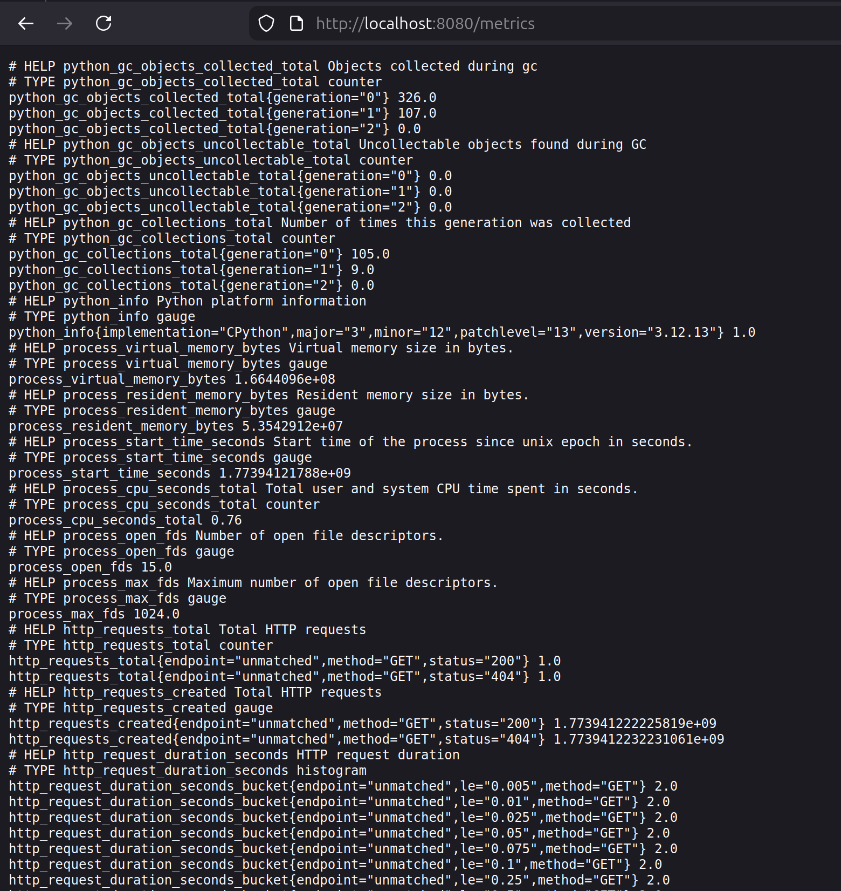
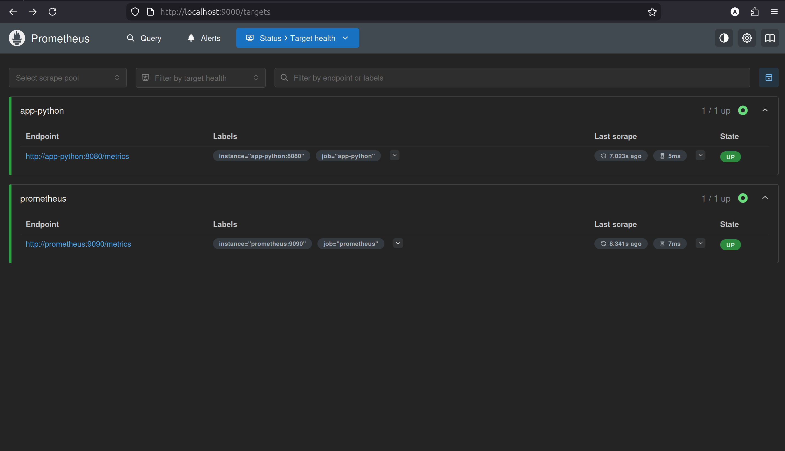
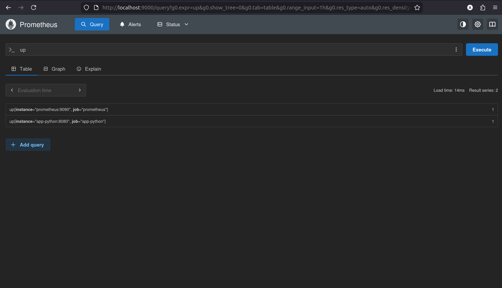
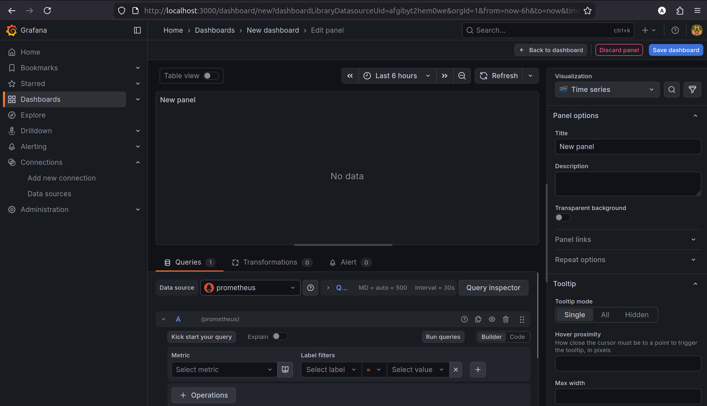
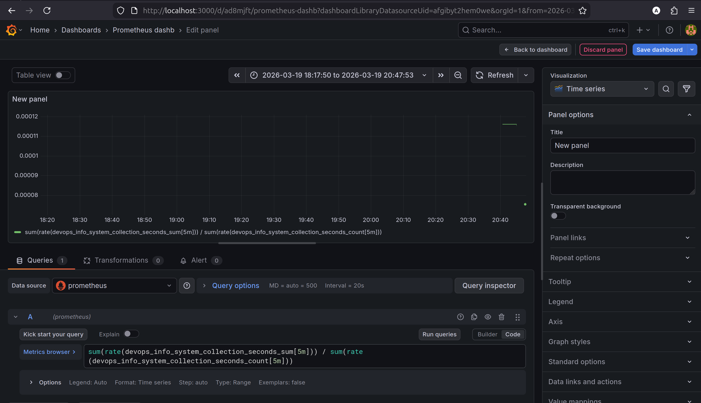
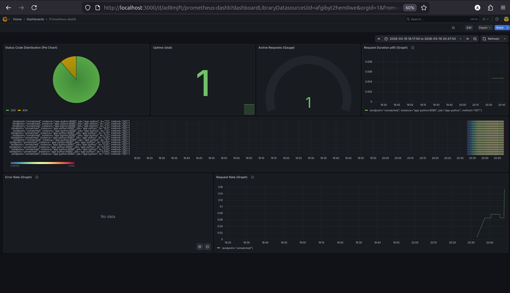
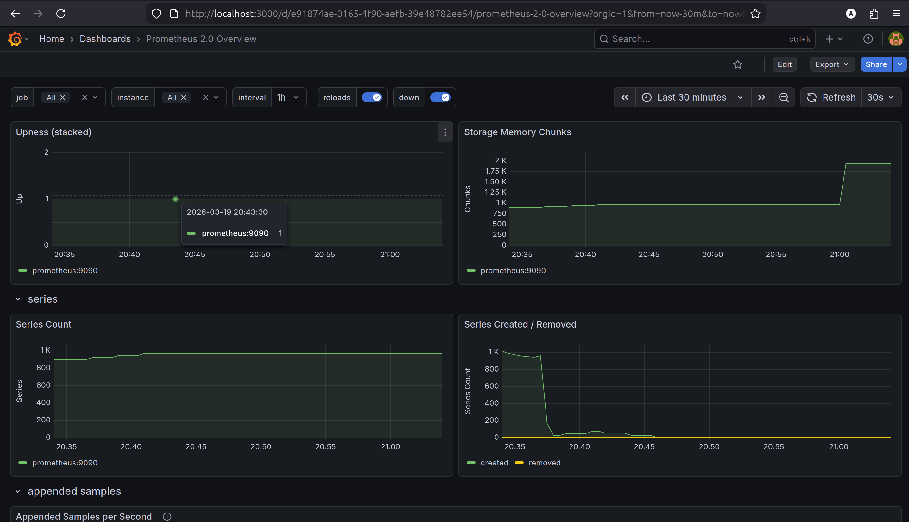
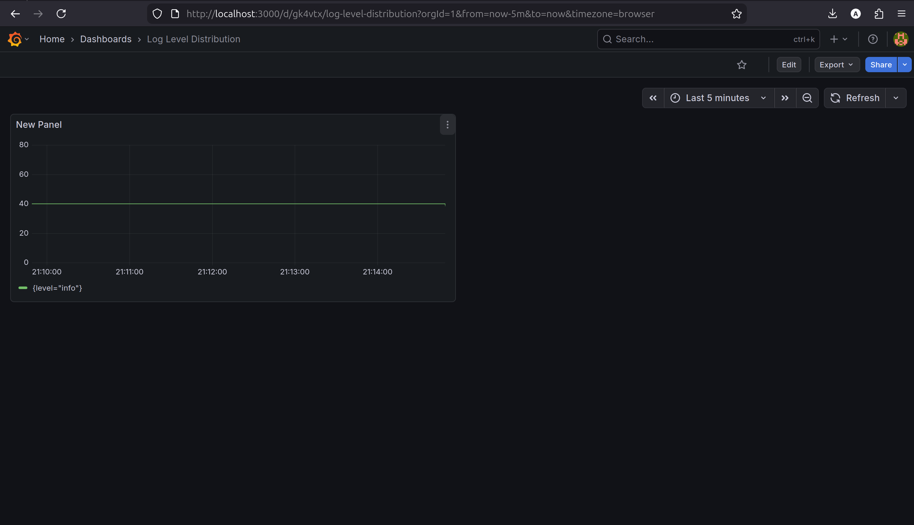
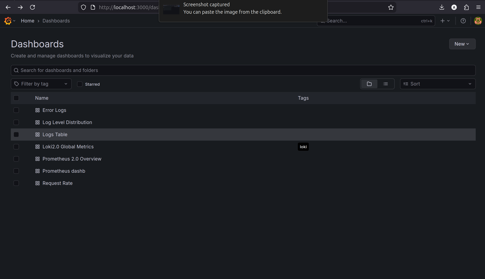

# Prometheus Setup Documentation

## Task 1

Configure app with prometheus client

1) `/metrics` endpoint:



2) [Code](../../app_python/app.py) showing metrics def-s:

```python
@app.get("/metrics")
async def metrics():
    """Prometheus metrics endpoint."""
    return Response(content=generate_latest(), media_type=CONTENT_TYPE_LATEST)


http_requests_total = Counter(
    'http_requests_total',
    'Total HTTP requests',
    ['method', 'endpoint', 'status']
)

http_request_duration_seconds = Histogram(
    'http_request_duration_seconds',
    'HTTP request duration',
    ['method', 'endpoint']
)

http_requests_in_progress = Gauge(
    'http_requests_in_progress',
    'HTTP requests currently being processed'
)

# Business / domain metrics (Beyond HTTP)
# Track endpoint usage (separate from http_requests_total)
endpoint_calls = Counter(
    "devops_info_endpoint_calls",
    "Endpoint calls",
    ["endpoint"],
)

# Track system info collection time
system_info_duration = Histogram(
    "devops_info_system_collection_seconds",
    "System info collection time",
)

# Examples for typical business metrics (wire them when you add the real integrations)
external_service_calls = Counter(
    "devops_info_external_service_calls_total",
    "API calls to external services",
    ["service", "result"],  # keep low-cardinality (e.g., result: ok|error|timeout)
)

cache_items = Gauge(
    "devops_info_cache_items",
    "Items in cache",
)

db_pool_size = Gauge(
    "devops_info_db_pool_size",
    "Current DB pool size",
)
```

3) Explaining your metric choices

#### Why these metrics were selected

The application uses three core metric types to follow the RED method and domain behavior:

- **Counter** (`http_requests_total`)  
  Tracks total request volume and error events over time.  
  Used for request rate and error rate queries.

- **Histogram** (`http_request_duration_seconds`)  
  Tracks request latency distribution (not only average).  
  Enables percentile queries such as p95/p99 and heatmaps.

- **Gauge** (`http_requests_in_progress`)  
  Tracks current number of active requests (concurrency/load snapshot).

#### Business metrics (beyond HTTP)

- **Counter** (`devops_info_endpoint_calls`)  
  Tracks endpoint usage from a product perspective (which endpoints are used most).

- **Histogram** (`devops_info_system_collection_seconds`)  
  Measures internal operation time for `get_system_info()`, helping detect slow system-info collection.

- **Counter** (`devops_info_external_service_calls_total`)  
  Prepared for external integrations; labels include service and result (`ok|error|timeout`).

- **Gauge** (`devops_info_cache_items`, `devops_info_db_pool_size`)  
  Tracks current cache size and DB pool size as runtime state indicators.

#### Label design and cardinality

Labels were chosen to stay useful and low-cardinality:

- `method` (GET/POST/...)
- `endpoint` (normalized route path)
- `status` (HTTP status code)

High-cardinality values (e.g., user IDs, raw dynamic URLs, IPs) are not used as metric labels to prevent time-series explosion and high memory usage in Prometheus.

#### Mapping to monitoring goals

- **Rate**: `http_requests_total`
- **Errors**: `http_requests_total{status=~"5.."}`
- **Duration**: `http_request_duration_seconds`
- **Current load**: `http_requests_in_progress`
- **Domain behavior**: `devops_info_*` metrics

This set provides both infrastructure-level and application-level observability with minimal overhead.

## Task 2

Prometheus server setup and demostration

1) Screenshot of `/targets` page showing all targets UP


2) Screenshot of a successful PromQL query:


3) [Configuration file](../prometheus/config.yaml)

```yaml
global:
  scrape_interval: 15s
  evaluation_interval: 15s

scrape_configs:
  - job_name: prometheus
    static_configs:
      - targets: ["prometheus:9090"]

  - job_name: app-python
    metrics_path: /metrics
    static_configs:
      - targets: ["app-python:8080"]
```

## Task 3

Grafana dashboards for Prometheus setup

Setup Prometheus as a data source and start boards:


1) Screenshot of your custom application dashboard with live data


Shows avg time of `get_system_info()` function.

```promql
sum(rate(devops_info_system_collection_seconds_sum[5m])) / sum(rate(devops_info_system_collection_seconds_count[5m]))
```

2) All 6+ panels working
   

Import of `3662` dashboard



3) JSON exported dashboard here: [../prometheus/dashboard-my.json](../prometheus/dashboard-my.json)

## Task 4

1) `docker compose ps` healthy
```bash
docker compose ps
NAME            IMAGE                                   COMMAND                  SERVICE      CREATED          STATUS                      PORTS
devops-python   projacktor/python-info-service:latest   "python app.py"          app-python   38 minutes ago   Up 38 minutes               0.0.0.0:8080->8080/tcp, [::]:8080->8080/tcp
grafana         grafana/grafana:12.3.1                  "/run.sh"                grafana      38 minutes ago   Up 38 minutes (healthy)     0.0.0.0:3000->3000/tcp, [::]:3000->3000/tcp
loki            grafana/loki:3.0.0                      "/usr/bin/loki -conf…"   loki         38 minutes ago   Up 38 minutes (unhealthy)   0.0.0.0:3100->3100/tcp, [::]:3100->3100/tcp
prometheus      prom/prometheus:v3.9.0                  "/bin/prometheus --c…"   prometheus   38 minutes ago   Up 38 minutes               0.0.0.0:9000->9090/tcp, [::]:9000->9090/tcp
promtail        grafana/promtail:3.0.0                  "/usr/bin/promtail -…"   promtail     38 minutes ago   Up 38 minutes               0.0.0.0:9080->9080/tcp, [::]:9080->9080/tcp
```

2) Documentation of retention policies

#### Prometheus retention policy
Prometheus retention is configured via startup arguments in `compose.yaml`:

- `--storage.tsdb.retention.time=15d`
- `--storage.tsdb.retention.size=10GB`

This means:
- metrics are stored for a maximum of **15 days**;
- or deleted earlier if the TSDB size exceeds **10GB**;
- whichever limit is reached first (time or size) is triggered.

Purpose of this setting:
- control disk usage;
- maintain a sufficient history window for analyzing trends and incidents;
- avoid performance degradation due to uncontrolled TSDB growth.

#### Persistence
Prometheus data is stored in the volume:
- `prometheus-data:/prometheus`

Therefore, after `docker compose down` / `up -d`, data is not lost (unless the volume is deleted with the `-v` command).

#### Other stack components
- **Loki** and **Grafana** also use persistent volumes (`loki-data`, `grafana-data`), which ensures data/dashboards persist across restarts.
- In this lab, the primary retention policy is explicitly set for Prometheus.

3) I checked that data is still alive since I have dashboards after `compose down` from previous lab



## Task 5

### Architecture

Metric flow in this lab:

```text
+-------------------+        scrape /metrics        +------------------+      PromQL      +------------------+
| app-python        | -----------------------------> | Prometheus       | ---------------> | Grafana          |
| (FastAPI +        |                                | (store + query)  |                  | (dashboards)     |
| prometheus_client)|                                |                  |                  |                  |
+-------------------+                                +------------------+                  +------------------+
         |                                                                                           |
         | logs (Lab 7 path)                                                                         | visual insights
         v                                                                                           v
     Promtail -----------------------------------------------> Loki ---------------------------> Grafana (logs)
```

### Application Instrumentation

Added metrics and rationale:

- `http_requests_total{method,endpoint,status}` (**Counter**)  
  For request rate and error rate (RED: Rate + Errors).
- `http_request_duration_seconds{method,endpoint}` (**Histogram**)  
  For latency distribution and percentiles (RED: Duration).
- `http_requests_in_progress` (**Gauge**)  
  Current concurrent requests.
- `devops_info_endpoint_calls{endpoint}` (**Counter**)  
  Business endpoint usage.
- `devops_info_system_collection_seconds` (**Histogram**)  
  Duration of `get_system_info()` business operation.
- `devops_info_external_service_calls_total{service,result}` (**Counter**)  
  External integration outcomes (`ok|error|timeout`).
- `devops_info_cache_items` / `devops_info_db_pool_size` (**Gauge**)  
  Runtime state of cache and DB pool.

### Prometheus Configuration

From `prometheus/config.yaml` and `compose.yaml`:

- Scrape interval: `15s`
- Evaluation interval: `15s`
- Targets:
  - `prometheus:9090`
  - `app-python:8080` with `metrics_path: /metrics`
- Retention:
  - `--storage.tsdb.retention.time=15d`
  - `--storage.tsdb.retention.size=10GB`
- Persistence volume:
  - `prometheus-data:/prometheus`

### Dashboard Walkthrough

Custom/used panels and purpose:

1. **Request rate by endpoint**  
   Query: `sum(rate(http_requests_total[5m])) by (endpoint)`  
   Purpose: traffic dynamics per route.

2. **5xx error rate**  
   Query: `sum(rate(http_requests_total{status=~"5.."}[5m]))`  
   Purpose: detect server-side failures quickly.

3. **p95 latency**  
   Query: `histogram_quantile(0.95, sum(rate(http_request_duration_seconds_bucket[5m])) by (le))`  
   Purpose: user-experience tail latency.

4. **In-progress requests**  
   Query: `http_requests_in_progress`  
   Purpose: concurrency/load pressure.

5. **Status code split**  
   Query: `sum by (status) (rate(http_requests_total[5m]))`  
   Purpose: quality of responses.

6. **System info avg duration**  
   Query: `sum(rate(devops_info_system_collection_seconds_sum[5m])) / sum(rate(devops_info_system_collection_seconds_count[5m]))`  
   Purpose: business operation performance.

### PromQL Examples (5+)

1. **Total RPS**  
   `sum(rate(http_requests_total[1m]))`  
   Shows current request throughput.

2. **RPS by endpoint**  
   `sum(rate(http_requests_total[5m])) by (endpoint)`  
   Shows hottest endpoints.

3. **Error percentage**  
   `100 * sum(rate(http_requests_total{status=~"5.."}[5m])) / sum(rate(http_requests_total[5m]))`  
   Shows failure ratio in percent.

4. **p95 latency (global)**  
   `histogram_quantile(0.95, sum(rate(http_request_duration_seconds_bucket[5m])) by (le))`  
   Shows high-percentile latency.

5. **p95 latency by endpoint**  
   `histogram_quantile(0.95, sum(rate(http_request_duration_seconds_bucket[5m])) by (le, endpoint))`  
   Shows slow routes.

6. **Endpoint usage share**  
   `100 * sum(rate(devops_info_endpoint_calls_total[5m])) by (endpoint) / scalar(sum(rate(devops_info_endpoint_calls_total[5m])))`  
   Shows business traffic distribution.

7. **Service availability**  
   `up{job="app-python"}`  
   Shows whether target is being scraped (`1` up, `0` down).

### Production Setup

Implemented production-oriented controls:

- Health checks for `app-python`, `grafana`, `loki`, `prometheus`
- Resource section present in Compose (`deploy.resources`) for limits/reservations policy
- Persistent volumes for stateful services:
  - `prometheus-data`, `grafana-data`, `loki-data`
- Retention limits to cap TSDB growth
- Internal Docker network (`loki-network`) for service communication

### Testing Results

Validation evidence collected:

- `/targets` page screenshot with scrape targets `UP`
- Dashboard screenshots with live series changing over time
- PromQL screenshots for RED method queries
- `docker compose ps` output proving stack status
- Persistence proof after restart (`down` / `up`) with data retained

### Challenges & Solutions

1. **Prometheus UI unavailable on localhost:9000**  
   Cause: wrong URL/port mapping confusion.  
   Fix: use `9000:9090` and open `http://localhost:9000/targets`.

2. **Duplicate timeseries error in app startup**  
   Cause: app module imported twice when starting via `python app.py` + string app reference.  
   Fix: run `uvicorn.run(app, ...)` in `__main__` or run via CLI only.

3. **`unmatched` endpoint dominance in charts**  
   Cause: endpoint label captured incorrectly in middleware and/or low traffic.  
   Fix: normalize route label and verify counters increment in endpoints.

4. **Health check mismatch on app port**  
   Cause: check used `localhost:8000` while app exposed `8080`.  
   Fix: update health check to `http://localhost:8080/health`.

### Metrics vs Logs — When to use each

- **Metrics**: aggregation, trends, SLO/SLA, alerting, low storage per signal.  
  Best for rate/error/latency monitoring and capacity planning.
- **Logs**: event-level forensic details, stack traces, payload/context.  
  Best for debugging specific incidents and root cause analysis.

In practice, metrics detect **that** a problem exists; logs explain **why** it happened.