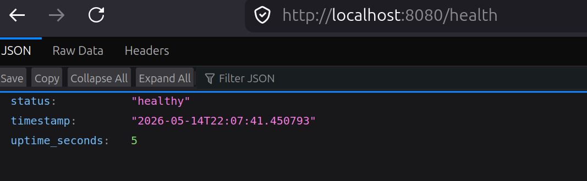
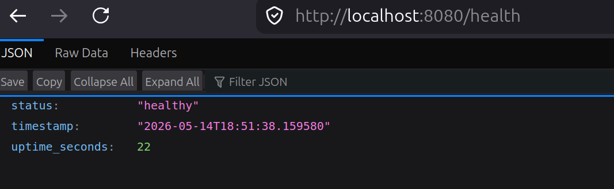

# Lab 18: Nix

## Task 1 Python app

### 1.1 Installation

Installation via Determinate system installer:

```sh
curl --proto '=https' --tlsv1.2 -sSf -L https://install.determinate.systems/nix | sh -s -- install
```

Verification:

```sh
. /nix/var/nix/profiles/default/etc/profile.d/nix-daemon.fish

nix
error: no subcommand specified

Try 'nix --help' for more information.

nix run nixpkgs#hello
Hello, world!

nix --version
nix (Determinate Nix 3.20.0) 2.34.6
```

### 1.3 Nix Derivation for python-info-service

Create a derivation for application in [default.nix](lab18/app_python/default.nix).

All fields explained in comments of the derivation.

I also added shebang line `#!/usr/bin/env python3` in [app.py](lab18/app_python/app.py) since it'll be easier for nix to execute script later after build.

Building:

```sh
nix-build

unpacking 'https://flakehub.com/f/DeterminateSystems/nixpkgs-weekly/%2A.tar.gz' into the Git cache...
this derivation will be built:
  /nix/store/ksvj22r2bfiz2z02xhfysmhwl7f3s59q-python-info-service-1.0.0.drv
these 88 paths will be fetched (4.3 MiB download, 532.6 MiB unpacked):
# <...>
```

Verify:

```sh
# we got result symlink to the build output
ls
app.py       Dockerfile    README.md             result@
data/        docs/         requirements-dev.txt  tests/
default.nix  __pycache__/  requirements.txt

./result/bin/python-info-service
INFO:     Started server process [23340]
INFO:     Waiting for application startup.
INFO:     Application startup complete.
INFO:     Uvicorn running on http://0.0.0.0:8080 (Press CTRL+C to quit)

curl localhost:8080/health | jq

{
  "status": "healthy",
  "timestamp": "2026-05-14T21:23:15.342864",
  "uptime_seconds": 163
}
```



### 1.4 reproducibility

```sh
readlink result
/nix/store/jwfg9gvv405zchi0vz4s7gik91f2gm43-python-info-service-1.0.0
```

Let me start from actual rebuilding w/o cache:

```sh
rm result

set STORE_PATH $(readlink result 2>/dev/null )

nix-store --delete $STORE_PATH 2>/dev/null

nix-build
readlink result
/nix/store/jwfg9gvv405zchi0vz4s7gik91f2gm43-python-info-service-1.0.0
```

Hash builds are identicall. SHA-1 hash computed from:

- Exact content of app.py
- Exact content of default.nix
- All dependency versions (transitively too)
- Build instructions in installPhase
- Compiler flags and environment


### Comparison: pip vs Nix

**Comparison table:**

| Aspect | Lab 1 (pip + venv) | Lab 18 (Nix) |
|--------|-------------------|--------------|
| Python version | System-dependent | Pinned in derivation |
| Dependency resolution | Runtime (`pip install`) | Build-time (pure) |
| Reproducibility | Approximate (with lockfiles) | Bit-for-bit identical |
| Portability | Requires same OS + Python | Works anywhere Nix runs |
| Binary cache | No | Yes (cache.nixos.org) |
| Isolation | Virtual environment | Sandboxed build |
| Store path | N/A | Content-addressable hash |
| Transitive deps | Drift over time | Frozen in nixpkgs |

**Why `requirements.txt` provides weaker guarantees than Nix:**

1. **No hash verification by default:**
   ```txt
   # requirements.txt
   fastapi==0.128.0  # Version pinned, but no hash
   ```
   - pip trusts PyPI, no cryptographic verification
   - Could be compromised without detection

2. **Transitive dependency drift:**
   ```txt
   # requirements.txt pins direct dependencies only
   fastapi==0.128.0
   
   # But fastapi depends on starlette, pydantic, etc.
   # These can update independently over time
   ```
   - You only pin what you install directly
   - Dependencies of dependencies can change
   - `pip install` today ≠ `pip install` next month

3. **System dependencies:**
   ```bash
   # pip uses system Python
   python --version  # Could be 3.11 on one machine, 3.12 on another
   
   # Different standard library, different behavior
   ```

4. **No build isolation:**
   ```bash
   # pip installs into venv, but build can access system packages
   # C extensions compile against system libraries
   ```

5. **Platform differences:**
   ```bash
   # Wheel compatibility varies by platform
   # Some packages compile differently on Linux vs macOS vs Windows
   ```

**Nix solves all these:**
- Every dependency (direct + transitive) pinned in nixpkgs
- Hash-based verification of all content
- Complete build isolation (sandboxed)
- Content-addressable storage proves reproducibility
- Same derivation = identical output on any machine, forever


### Reflection

**How would Nix have helped in Lab 1 if used from the start?**

1. **No "works on my machine" problems:**
   - In Lab 1, I had to ensure Python 3.13 was installed
   - With Nix, Python version is pinned in the derivation
   - Any student could build and run with identical environment

2. **Faster onboarding for new students:**
   ```bash
   # Lab 1 setup (manual, error-prone):
   sudo apt install python3.13 python3-pip
   python3.13 -m venv venv
   source venv/bin/activate
   pip install -r requirements.txt
   
   # Lab 18 with Nix (one command):
   nix-build
   ./result/bin/python-info-service
   ```

3. **Guaranteed reproducibility over time:**
   - If I revisit Lab 1 code in 6 months, `pip install` might fail
   - Dependencies could be removed from PyPI, versions updated
   - With Nix, the same derivation works forever

4. **Better CI/CD integration:**
   - CI builds would be identical to local builds
   - Binary cache speeds up CI (no need to rebuild dependencies)
   - Hash verification ensures no supply chain attacks

5. **Easier debugging:**
   - Exact dependency tree visible in Nix store
   - Can inspect any dependency's source code
   - No "it works on my machine" excuses in code reviews

**Personal takeaway:** Nix provides **cryptographic reproducibility** that traditional tools simply cannot match. For production DevOps workflows, this means:
- Security audits can verify exact dependency tree
- Rollbacks are guaranteed to work (same hash = same binary)
- Multi-team collaboration has no environment drift
- Long-term maintenance is sustainable (dependencies don't rot)

The learning curve is steeper than `pip install`, but the guarantees are worth it for critical infrastructure.

## Task 2 Docker 

### 2.1 Docker rewriting

I made a [docker.nix](./lab18/app_python/docker.nix) with explained all field in file.

What's different in `Dockerfile` and `docker.nix`:

| Aspect | Dockerfile (Lab 2) | docker.nix (Lab 18) |
|--------|-------------------|---------------------|
| **Base image** | `python:3.12-slim` (changes sometimes) | ❌ no base image |
| **Timestamp** | Different in each build | `1970-01-01T00:00:01Z` (fixed) |
| **Deps** | `pip install` while build | Nix store paths (immutable) |
| **Reproducibility** | ❌ Different hashes | ✅ same hashes |
| **Cache** | Layer-based (breaks on timestamps) | Content-addressable |

and also image sizes, below you'll see nix one is less.

Buildin-n-test:

```bash
nix-build docker.nix
#<..>
Creating layer 54 with customisation...
Adding manifests...
Done.
/nix/store/r74q42vch9n4ry1h6aph0dygn9hzpqx1-python-info-service-nix.tar.gz

ls -lh result
lrwxrwxrwx 1 projacktor projacktor 74 May 14 21:49 result -> /nix/store/r74q42vch9n4ry1h6aph0dygn9hzpqx1-python-info-service-nix.tar.gz

docker load < result
Loaded image: python-info-service-nix:1.0.0

docker images | grep python-info-service
WARNING: This output is designed for human readability. For machine-readable output, please use --format.
projacktor/python-info-service:latest   b9ce5f81b1ff        302MB         71.7MB        
python-info-service-nix:1.0.0           0fc38f42484c        515MB          251MB  

docker run -d -p 8080:8080 --name nix-container python-info-service-nix:1.0.0
ae6ccc05733d7446ffa1f01be1720bba771c4c68d1d72b2a5b14e69ddfb19d27

curl localhost:8080/health | jq
  % Total    % Received % Xferd  Average Speed   Time    Time     Time  Current
                                 Dload  Upload   Total   Spent    Left  Speed
100    81  100    81    0     0  32490      0 --:--:-- --:--:-- --:--:-- 40500
{
  "status": "healthy",
  "timestamp": "2026-05-14T18:51:43.192716",
  "uptime_seconds": 27
}

docker stop nix-container
docker rm nix-container
```



Reproducibility prove:

```bash
# First build
nix-build docker.nix
set HASH1 $(sha256sum result | cut -d' ' -f1)
echo "Hash 1: $HASH1"
# Hash 1: 0718b9077e686cbc7491622db9f49039c07db47e70103c385d2869b2ec58531f

# removing and second one
rm result
nix-build docker.nix
set HASH2 $(sha256sum result | cut -d' ' -f1)
echo $HASH2
# 0718b9077e686cbc7491622db9f49039c07db47e70103c385d2869b2ec58531f
```

Yay, hashes the same, reproducable.

If hashes differ between builds, it's usually because:

- Nix reused cached build from first build
- One of the inputs changed (app.py, default.nix, docker.nix)
- Different nixpkgs version was used
- The store path (/nix/store/r74q42vch9n4ry1h6aph0dygn9hzpqx1-python-info-service-nix.tar.gz) is what matters - it will be identical on any machine with the same inputs.

Why traditional Dockerfiles can't achieve bit-for-bit reproducibility:

- Base image drift: python:3.12-slim tag points to different image digest over time
- Build timestamps: Each layer includes build timestamp, making hash different
- Package installation: pip install resolves dependencies at build time, not lock time
- Layer ordering: Build order can vary, changing layer hashes
- How Nix solves this:

No base image: Pure derivations, no external dependencies
Fixed timestamp: `created = "1970-01-01T00:00:01Z"` ensures identical timestamps
Content-addressable: Same inputs → same hash, always
Sandboxed builds: No access to system state, network, or random data
Why image size differs:

- Lab 2 Dockerfile	~150MB+	Full Python base image + pip cache
- Lab 18 Nix	~251MB	Nix store closure (includes all deps)

#### Containers history:

```sh
docker images | grep python-info-service
WARNING: This output is designed for human readability. For machine-readable output, please use --format.
projacktor/python-info-service:latest   b9ce5f81b1ff        302MB         71.7MB        
python-info-service-nix:1.0.0           0fc38f42484c        515MB          251MB

docker history projacktor/python-info-service:la
test 
IMAGE          CREATED       CREATED BY                                      SIZE      COMMENT
b9ce5f81b1ff   7 days ago    CMD ["python" "app.py"]                         0B        buildkit.dockerfile.v0
<missing>      7 days ago    EXPOSE [8080/tcp]                               0B        buildkit.dockerfile.v0
<missing>      7 days ago    USER app                                        0B        buildkit.dockerfile.v0
<missing>      7 days ago    RUN /bin/sh -c mkdir -p /app/data && chown -…   86kB      buildkit.dockerfile.v0
<missing>      7 days ago    COPY . . # buildkit                             81.9kB    buildkit.dockerfile.v0
<missing>      7 days ago    RUN /bin/sh -c pip install --upgrade pip && …   95.8MB    buildkit.dockerfile.v0
<missing>      7 days ago    COPY requirements.txt ./ # buildkit             12.3kB    buildkit.dockerfile.v0
<missing>      7 days ago    WORKDIR /app                                    8.19kB    buildkit.dockerfile.v0
<missing>      7 days ago    RUN /bin/sh -c groupadd -r app && useradd -r…   41kB      buildkit.dockerfile.v0
<missing>      3 weeks ago   CMD ["python3"]                                 0B        buildkit.dockerfile.v0
<missing>      3 weeks ago   RUN /bin/sh -c set -eux;  for src in idle3 p…   16.4kB    buildkit.dockerfile.v0
<missing>      3 weeks ago   RUN /bin/sh -c set -eux;   savedAptMark="$(a…   41.3MB    buildkit.dockerfile.v0
<missing>      3 weeks ago   ENV PYTHON_SHA256=c08bc65a81971c1dd578318282…   0B        buildkit.dockerfile.v0
<missing>      3 weeks ago   ENV PYTHON_VERSION=3.12.13                      0B        buildkit.dockerfile.v0
<missing>      3 weeks ago   ENV GPG_KEY=7169605F62C751356D054A26A821E680…   0B        buildkit.dockerfile.v0
<missing>      3 weeks ago   RUN /bin/sh -c set -eux;  apt-get update;  a…   4.94MB    buildkit.dockerfile.v0
<missing>      3 weeks ago   ENV LANG=C.UTF-8                                0B        buildkit.dockerfile.v0
<missing>      3 weeks ago   ENV PATH=/usr/local/bin:/usr/local/sbin:/usr…   0B        buildkit.dockerfile.v0
<missing>      3 weeks ago   # debian.sh --arch 'amd64' out/ 'trixie' '@1…   87.4MB    debuerreotype 0.17
```

```sh
docker history projacktor/python-info-service:la
test 
IMAGE          CREATED       CREATED BY                                      SIZE      COMMENT
b9ce5f81b1ff   7 days ago    CMD ["python" "app.py"]                         0B        buildkit.dockerfile.v0
<missing>      7 days ago    EXPOSE [8080/tcp]                               0B        buildkit.dockerfile.v0
<missing>      7 days ago    USER app                                        0B        buildkit.dockerfile.v0
<missing>      7 days ago    RUN /bin/sh -c mkdir -p /app/data && chown -…   86kB      buildkit.dockerfile.v0
<missing>      7 days ago    COPY . . # buildkit                             81.9kB    buildkit.dockerfile.v0
<missing>      7 days ago    RUN /bin/sh -c pip install --upgrade pip && …   95.8MB    buildkit.dockerfile.v0
<missing>      7 days ago    COPY requirements.txt ./ # buildkit             12.3kB    buildkit.dockerfile.v0
<missing>      7 days ago    WORKDIR /app                                    8.19kB    buildkit.dockerfile.v0
<missing>      7 days ago    RUN /bin/sh -c groupadd -r app && useradd -r…   41kB      buildkit.dockerfile.v0
<missing>      3 weeks ago   CMD ["python3"]                                 0B        buildkit.dockerfile.v0
<missing>      3 weeks ago   RUN /bin/sh -c set -eux;  for src in idle3 p…   16.4kB    buildkit.dockerfile.v0
<missing>      3 weeks ago   RUN /bin/sh -c set -eux;   savedAptMark="$(a…   41.3MB    buildkit.dockerfile.v0
<missing>      3 weeks ago   ENV PYTHON_SHA256=c08bc65a81971c1dd578318282…   0B        buildkit.dockerfile.v0
<missing>      3 weeks ago   ENV PYTHON_VERSION=3.12.13                      0B        buildkit.dockerfile.v0
<missing>      3 weeks ago   ENV GPG_KEY=7169605F62C751356D054A26A821E680…   0B        buildkit.dockerfile.v0
<missing>      3 weeks ago   RUN /bin/sh -c set -eux;  apt-get update;  a…   4.94MB    buildkit.dockerfile.v0
<missing>      3 weeks ago   ENV LANG=C.UTF-8                                0B        buildkit.dockerfile.v0
<missing>      3 weeks ago   ENV PATH=/usr/local/bin:/usr/local/sbin:/usr…   0B        buildkit.dockerfile.v0
<missing>      3 weeks ago   # debian.sh --arch 'amd64' out/ 'trixie' '@1…   87.4MB    debuerreotype 0.17
projacktor@projacktorLaptop ~/P/e/D/l/l/app_python (lab18)> docker history python-info-service-nix:1.0.0 
IMAGE          CREATED   CREATED BY   SIZE      COMMENT
0fc38f42484c   N/A                    69.6kB    store paths: ['/nix/store/kz4k6na0zbx88xqkdd32zjqq7hm5yj30-python-info-service-nix-customisation-layer']
<missing>      N/A                    61.4kB    store paths: ['/nix/store/jhqwg0xssgy671ifpkh4jbbxcjyjdq2z-python-info-service-1.0.0']
<missing>      N/A                    2.15MB    store paths: ['/nix/store/c6k21wz193fxj8hnaag8vdzjb4s5klrh-python3.13-fastapi-0.128.0']
<missing>      N/A                    6.42MB    store paths: ['/nix/store/ag4bfzyf72xsq08d7lcn0l8fhjdfrg1k-python3.13-pydantic-2.12.5']
<missing>      N/A                    1.22MB    store paths: ['/nix/store/r70kacvi02lxf71qmdhqqfjfbbzcr2pc-python3.13-httpx-0.28.1']
<missing>      N/A                    5.77MB    store paths: ['/nix/store/vvhij4y7ax92mcdm0nacvp3ldv643xfx-python3.13-pydantic-core-2.41.5']
<missing>      N/A                    1.25MB    store paths: ['/nix/store/lyga6ji3x5q6h2dvc5xxd94ck1gs3ij4-python3.13-starlette-0.52.1']
<missing>      N/A                    2.11MB    store paths: ['/nix/store/7y5zfyjwhqgxil8kq9qqsfbw00rmqzrn-python3.13-anyio-4.13.0']
<missing>      N/A                    1.25MB    store paths: ['/nix/store/hgsr99pnjk2bcjc4z3m0z6a76kgjnlyh-python3.13-httpcore-1.0.9']
<missing>      N/A                    1.26MB    store paths: ['/nix/store/4dfqs545z25rzsvwpsxzk4s0cxwpl0wb-python3.13-uvicorn-0.40.0']
<missing>      N/A                    2.07MB    store paths: ['/nix/store/2kwicy8c1ab6zw8p1ps3nnn623b68dn0-python3.13-jinja2-3.1.6']
<missing>      N/A                    1.04MB    store paths: ['/nix/store/s5ivyxnkhy905iwch5dsp0arm26plfrg-python3.13-prometheus-client-0.24.1']
<missing>      N/A                    639kB     store paths: ['/nix/store/hqpy59n4gai7vdd2wdzvgax6gjnk83wc-python3.13-certifi-2026.01.04']
<missing>      N/A                    1.45MB    store paths: ['/nix/store/77p6rnrhbc14aaw7iwf6d7vxl89qa9kj-python3.13-click-8.3.1']
<missing>      N/A                    1.21MB    store paths: ['/nix/store/jl0mxihyizv77l66mzbvmv49iiri72sd-python3.13-pyyaml-6.0.3']
<missing>      N/A                    1.06MB    store paths: ['/nix/store/ffl6rnq6adprav63d171av3v1a9c4a7x-python3.13-idna-3.11']
<missing>      N/A                    365kB     store paths: ['/nix/store/clvgpay9knl5fqz8k9zaj9g2z95zs5x3-python3.13-asgiref-3.11.0']
<missing>      N/A                    217kB     store paths: ['/nix/store/x35j77y5n7xm66dgphwlxw57x9h3iv9w-python3.13-typing-inspection-0.4.2']
<missing>      N/A                    569kB     store paths: ['/nix/store/vp69b30dzx21lqy3k6bj5ni4sp8bqkxm-python3.13-typing-extensions-4.15.0']
<missing>      N/A                    430kB     store paths: ['/nix/store/yz02xvcmxq8x69vdfhabqls4qpbi2n2h-python3.13-h11-0.16.0']
<missing>      N/A                    401kB     store paths: ['/nix/store/bvpg5qhilc2swmirlw5gwqywl2rpzzv0-python3.13-python-multipart-0.0.22']
<missing>      N/A                    258kB     store paths: ['/nix/store/ngjjspj253cfzvlyh9x2yp705acxyzsn-python3.13-python-json-logger-4.0.0']
<missing>      N/A                    180kB     store paths: ['/nix/store/3wcchwbssrqa4r4w10019ip4kvfadqzc-python3.13-annotated-types-0.7.0']
<missing>      N/A                    180kB     store paths: ['/nix/store/jpyvycfsc7gx267kaswq71dawa5ng0vq-python3.13-markupsafe-3.0.3']
<missing>      N/A                    102kB     store paths: ['/nix/store/bpa8m1ibsgd2zz4js14mwpqh9i1psllj-python3.13-annotated-doc-0.0.4']
<missing>      N/A                    140MB     store paths: ['/nix/store/0r6k8xa2kgqyp3r4v2w7yrb80ma2iawm-python3-3.13.12']
<missing>      N/A                    1.72MB    store paths: ['/nix/store/jjxngswsb214vb58qx485jhmilf0kxxy-coreutils-9.10']
<missing>      N/A                    815kB     store paths: ['/nix/store/5yypk94lvsbvskjz5xyav09j5ydxm8za-gmp-with-cxx-6.3.0']
<missing>      N/A                    10.4MB    store paths: ['/nix/store/si4q3zks5mn5jhzzyri9hhd3cv789vlm-gcc-15.2.0-lib']
<missing>      N/A                    9.36MB    store paths: ['/nix/store/wbyqkb1vpm41s4jb8pv0i9h4jv08xdrv-openssl-3.6.1']
<missing>      N/A                    5.89MB    store paths: ['/nix/store/5087xk8l09k90gddzw8y9b4yypyn23a5-sqlite-3.51.2']
<missing>      N/A                    532kB     store paths: ['/nix/store/47h2ny0j1xbz879a9s7s55fyv3zawr3r-readline-8.3p3']
<missing>      N/A                    8.94MB    store paths: ['/nix/store/2iaawa9vbqas51lgpn4cjnnfdv74x8fn-ncurses-6.6']
<missing>      N/A                    2.14MB    store paths: ['/nix/store/291rd5nk7hkhcpzbh7pxqiz75xikdll3-util-linux-minimal-2.42-lib']
<missing>      N/A                    1.95MB    store paths: ['/nix/store/i27rhb3nr65rkrwz36bchkwmav6ggsmn-bash-5.3p9']
<missing>      N/A                    1.13MB    store paths: ['/nix/store/hmslvsxvs2ijb7iw5krdckai2im6vp2y-xz-5.8.3']
<missing>      N/A                    647kB     store paths: ['/nix/store/rnaq5b0la7pcq6hyf86iy8ihazgcamg6-gdbm-1.26-lib']
<missing>      N/A                    348kB     store paths: ['/nix/store/pa6n8nrmgq8jswk2pkrl5qprcls1r0ch-expat-2.7.5']
<missing>      N/A                    270kB     store paths: ['/nix/store/yw0fl2v8g35w2dii8phnr0fjb9nr1b0b-mpdecimal-4.0.1']
<missing>      N/A                    250kB     store paths: ['/nix/store/bifwnk7bvspj2mqc1w7dcydz8lkvfy1q-acl-2.3.2']
<missing>      N/A                    172kB     store paths: ['/nix/store/5by3i4053gppzf3ci7ygv1mj8gjhp6mk-libyaml-0.2.5']
<missing>      N/A                    168kB     store paths: ['/nix/store/ixhlv41i2wpl84xgjcks061dz4yssbg3-zlib-1.3.2']
<missing>      N/A                    238kB     store paths: ['/nix/store/sl325r3s6d4gl9lmr2hwg2wgp2m0qs7c-attr-2.5.2']
<missing>      N/A                    115kB     store paths: ['/nix/store/2amncb4zvr32gm5d2i8m6gz29c02cn61-bzip2-1.0.8']
<missing>      N/A                    98.3kB    store paths: ['/nix/store/hyai3q7gvdfppw4ky7s2mvhxvfyp5bh7-libffi-3.5.2']
<missing>      N/A                    36.7MB    store paths: ['/nix/store/fjkx1l5cnskzrqacf08z7i8z17256w0j-glibc-2.42-61']
<missing>      N/A                    664kB     store paths: ['/nix/store/sgswwrxkhdlfskklqp4gsbi2cskfg07c-libidn2-2.3.8']
<missing>      N/A                    5.33MB    store paths: ['/nix/store/cxjmhdbpy3bk12jc6lwpmcvlas76a7zm-tzdata-2026a']
<missing>      N/A                    2.11MB    store paths: ['/nix/store/i4gg1f526vl5psg5nqniflj4v77vc1kd-libunistring-1.4.2']
<missing>      N/A                    791kB     store paths: ['/nix/store/zp564phiicll8d53d973gbh8y3iiwlm7-nss-cacert-3.121']
<missing>      N/A                    225kB     store paths: ['/nix/store/wrxyd3k2f4bmh52pr5rpdjxxsm5r2qxm-gcc-15.2.0-libgcc']
<missing>      N/A                    225kB     store paths: ['/nix/store/xx0z77494lfxr8qjwpck246fry05n3nm-xgcc-15.2.0-libgcc']
<missing>      N/A                    492kB     store paths: ['/nix/store/0minj1ypl50k4zl85gsngfw0z0y9ddg0-util-linux-minimal-2.42']
<missing>      N/A                    164kB     store paths: ['/nix/store/b73wvf83q4cjwzz99pdanbl8qpfawr69-mailcap-2.1.54']
```

Observation: Lab 2 image has many layers with timestamps, Nix image has minimal layers with fixed timestamp.

### Reflection
If I could redo Lab 2 with Nix:

- Start with Nix from the beginning: No need to maintain both Dockerfile and docker.nix
- Use flakes for nixpkgs pinning: Ensures same version across all developers
- Set up CI with Nix cache: Faster builds with binary cache
- Use Nix for local development: nix develop gives identical environment to production

Practical scenarios where Nix reproducibility matters:
- Security audits: Verify exact dependency tree, no supply chain attacks
- Compliance: Prove build reproducibility for regulatory requirements
- Disaster recovery: Rebuild exact same image years later
- Multi-cloud: Same image works on AWS, GCP, Azure without variation
- Rollbacks: Guaranteed to get identical binary when rolling back version


Personal takeaway: Nix Docker images are slower to build initially but provide cryptographic guarantees that traditional Docker cannot match. For production systems where reproducibility matters, Nix is worth the learning curve.